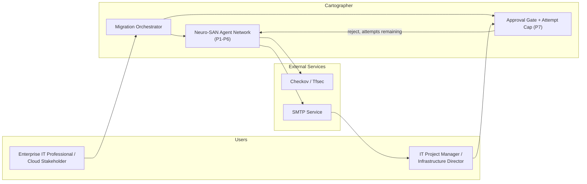
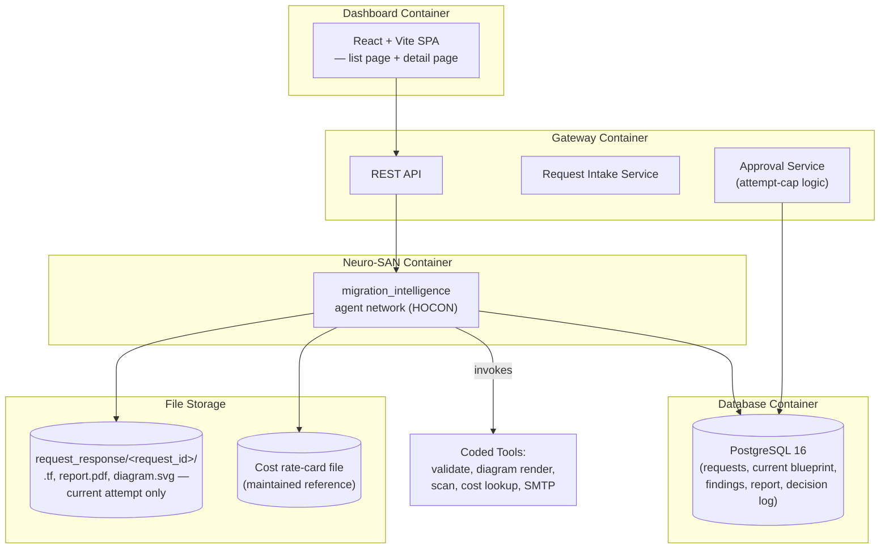
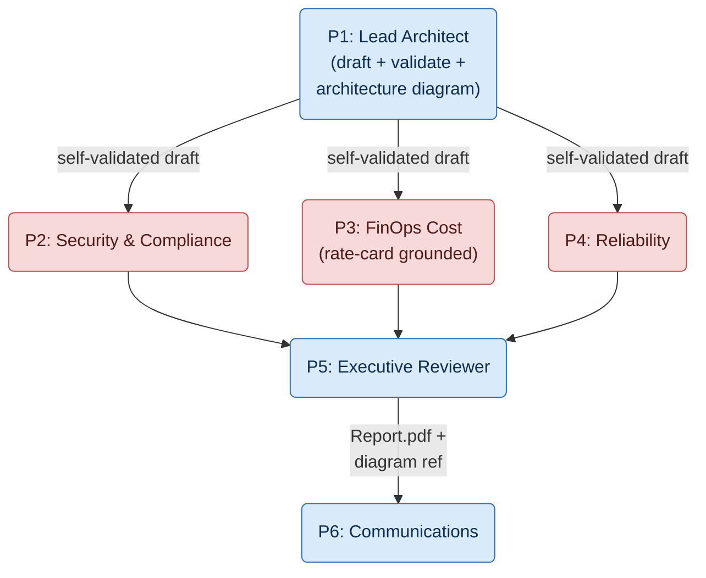
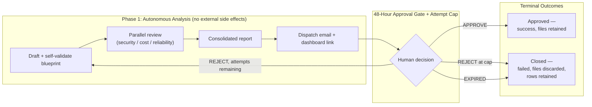
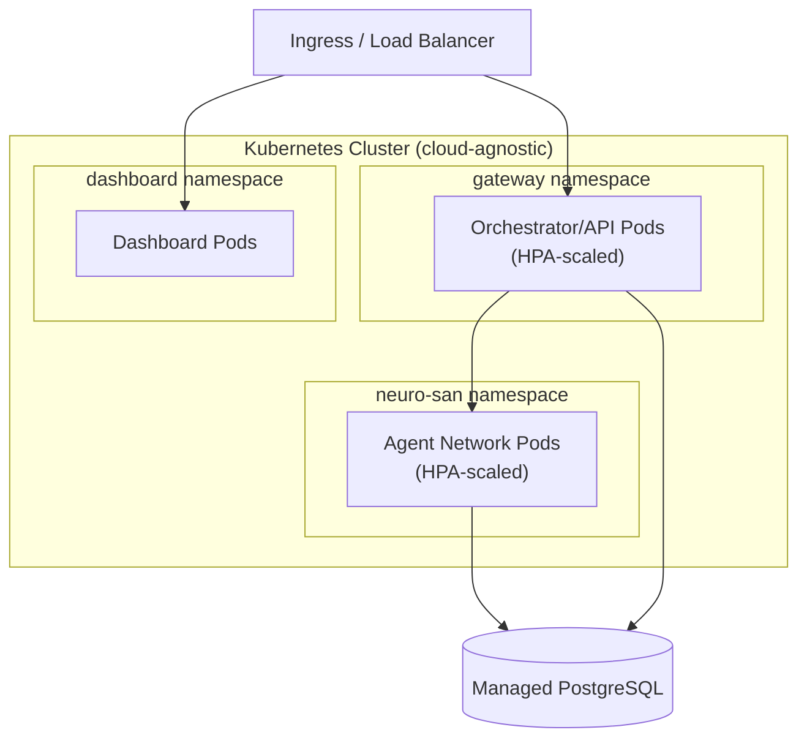
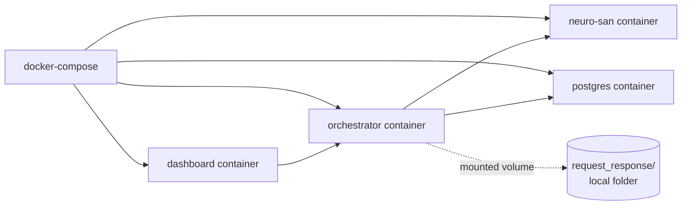

# Cartographer — Architecture

**Author:** Sanjana Mohanty
**Co-Author:** Teja Sree Kuppi Reddy

---

## 1. What Cartographer Is

Cartographer is an AI agent network that automates the **analysis, drafting, and recommendation** stage of a cloud migration — the slow, meeting-heavy phase where Solutions Architects, Security Officers, and FinOps teams manually draft, review, and argue over a cloud infrastructure blueprint before a single line of data ever moves.

Enterprises migrating from legacy on-premises databases (Oracle, Microsoft SQL Server, IBM DB2) to cloud-native platforms (AWS, Azure, GCP) typically lose weeks to this phase because validation is siloed: drafting, compliance checking, cost estimation, and reliability review happen sequentially, across disconnected teams, with no single accountable synthesis for the executive who ultimately has to sign off.

Cartographer collapses that cycle. Given a migration prompt and a structured `project.json` (server topologies, hardware specs, software inventory, utilization metrics, network throughput, security posture), it produces a fully drafted, self-validated, multi-angle-reviewed migration plan — complete with Infrastructure-as-Code, a visual architecture diagram, and a consolidated report — in minutes instead of weeks, and hands the final call to a human.

## 2. How Cartographer Achieves It

Cartographer is built as a **multi-agent system**, not a single model wrapped in a script. This is a deliberate, load-bearing design choice, not an implementation detail:

- **Specialized agents replace specialized teams.** Rather than one general-purpose model trying to be an architect, a security auditor, a FinOps analyst, and a reliability engineer at once, Cartographer runs a network of purpose-built agents — each with a narrow mandate — that mirrors the way real migration review boards are staffed.
- **Parallel review, not a hand-off chain.** The security, cost, and reliability agents evaluate the same draft blueprint at the same time, rather than passing a document down a line. This is where most of the multi-week delay in the manual process actually lives, and it's the first thing the agentic design removes.
- **Self-validation before critique.** The drafting agent validates its own Infrastructure-as-Code output before it's ever exposed to the critic agents, so downstream review time isn't wasted on syntactically broken drafts.
- **A synthesizing agent, not a dashboard.** Findings from the parallel critics don't just get concatenated — a dedicated reviewing agent digests them into a single, categorized executive brief, which is what actually restores the "one accountable synthesis" that the manual process lost.
- **Agentic hand-off, human authority.** Every agent's output becomes the next agent's input automatically, end to end — drafting, diagramming, validation, critique, synthesis, and notification — right up until the point of approval. That decision is never automated: a human is always the one who moves a request to a terminal, successful state.
- **Traceability by construction.** Because the work is done by a sequence of discrete, named agents rather than one opaque pass, every stage of the decision — what was drafted, what was flagged, by which reviewer, and why — is separately attributable and retained, not just the final output.

In short: Cartographer's core bet is that decomposing "review a migration plan" into a network of cooperating, specialized agents — some drafting, some critiquing in parallel, one synthesizing, one communicating — is what makes it possible to compress a multi-week, multi-team process into a single automated pass, without removing the human sign-off that makes the recommendation trustworthy.

## 3. Diagram Views

Six views are covered below: system landscape, container view, agent network topology, cross-phase signal flow, production deployment, and hackathon deployment.

> **Note:** these are *system* architecture diagrams describing how Cartographer itself is built. They are distinct from the **migration architecture diagram** that the Lead Architect Agent generates as a product deliverable for each migration request — that per-request diagram is a rendered SVG/PNG of the target cloud resources being proposed for the stakeholder's own workload, attached to the approval-request email alongside a `Report.pdf` summary.

> **Scope reminder carried through every view below:** there is no live target-cloud-provider integration and no deployment runner in this release. Nothing in this document depicts a `terraform apply` call or a connection to AWS/Azure/GCP as a running system — the target cloud provider is only ever a string the Lead Architect Agent uses to select which Terraform provider block to draft.

---

## V1 — System Landscape

## V2 — Container View (Deployable Units)

## V3 — Agent Network Topology (Inside Neuro-SAN)

> P1's self-validation loop (draft → `terraform_validate_tool` → retry or proceed) happens before this fan-out. There is no P8 in this topology.

## V4 — Cross-Phase Signal Flow (The Differentiator)

This is what separates this system from a simple pipeline: **Phase 1 (fully automated analysis)** and **Phase 2 (the human approval gate)** are strictly separated by one signal — the approval decision — and that decision now branches three ways instead of two.

> The prior version of this diagram routed both "expired" and "rejected" to the *same* redraft arrow back into Phase 1, and Phase 2 was labeled "Live Execution" with a `terraform apply` step. Both are corrected here: only a reject *under* the attempt cap redrafts; expiry and a reject *at* the cap both close the request with no further automation, and there is no execution phase in this release.

## V5 — Production Deployment (Conceptual)

> **Open item, not resolved in this diagram:** generated files (`report.pdf`, diagram, `.tf`) need an actual object/file store here — local-disk storage (fine for the hackathon topology in V6) does not survive these pods being horizontally scaled or restarted. Intentionally left as an open item rather than designed further here.

## V6 — Hackathon Deployment (docker-compose)

