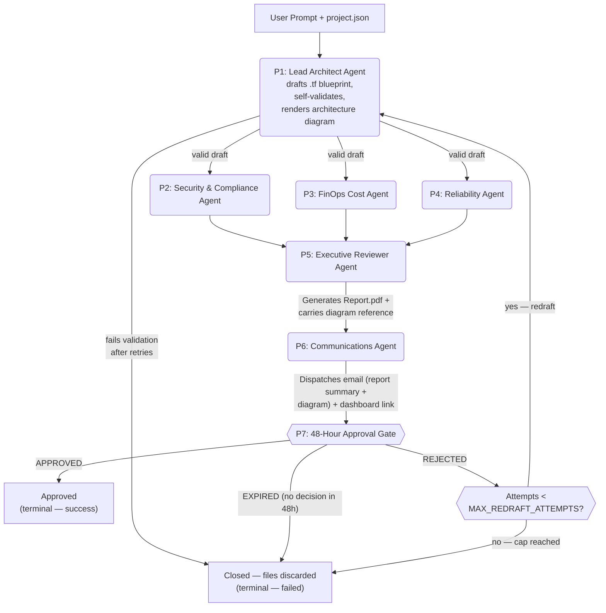

# Cartographer — Problem Statement & Proposed Solution

**Project:** Smart Infrastructure Migration & Deployment Gating
**Built with:** Neuro-SAN | Cognizant Internal Hackathon

**Role in this document set:** This is the **single authoritative source** for both the business problem and the proposed solution. Companion documents: [DFD](01-dfd.md) · [HLD](02-hld.md) · [LLD](03-lld.md) · [Architecture Diagrams](04-architecture-diagram.md).

---

## 1. The Problem

When enterprises plan to migrate applications and data from legacy on-premises databases (such as Oracle, Microsoft SQL Server, or IBM DB2) to cloud-native platforms (AWS, Azure, or GCP), the initial architectural design phase is notoriously slow. Solutions Architects, Security Officers, and FinOps (Financial Operations) teams spend weeks in cross-departmental meetings manually drafting, reviewing, and altering cloud infrastructure blueprints.

This manual process is heavily constrained by three major bottlenecks:

| Bottleneck | Description |
|---|---|
| **Siloed Validation Cycles** | Drafting the infrastructure plan, checking it against complex regulatory frameworks, estimating cost, and running reliability math happen sequentially across disconnected teams. |
| **The Blueprint-to-Code Gap** | Turning a high-level conceptual migration plan into secure, enterprise-grade, production-ready Infrastructure as Code (IaC) like Terraform requires intensive engineering effort and is highly prone to human error. |
| **High-Stakes, Black-Box Recommendations** | Without clear, context-aware synthesis of security, cost, and reliability impacts, executive stakeholders lack the confidence to sign off on a plan, delaying time-to-value for months. |

## 2. The Compounding Business Impact

- **Delayed Migration Velocity** — Enterprises take 4 to 8 weeks just to approve a single migration blueprint before a single line of data is moved.
- **Wasted Architectural Overhead** — Dozens of cross-departmental engineering hours are lost per week to alignment meetings and manual compliance checklist audits.
- **Day-1 Security & Budget Blind Spots** — Misconfigured cloud resources (e.g., unencrypted databases, over-provisioned VMs) slip past manual reviews, resulting in avoidable cost or compliance risk once a plan does move forward.

## 3. Why This Matters Now

Cloud migration is no longer optional for most enterprises, but the review process hasn't scaled with the pace of demand. Every week spent in alignment meetings is a week of dual-running costs (legacy + planned cloud spend), delayed modernization, and accumulating technical debt. A faster review process that does **not** sacrifice security or cost discipline is the gap this project addresses.

---

## 4. Solution Overview

An AI agent network — built on **Neuro-SAN** — that automates the end-to-end cloud migration **analysis and recommendation** lifecycle. The system ingests source database configurations, target cloud requirements, and a comprehensive `project.json` file (containing server topologies, hardware specifications, software inventory, utilization/performance metrics, network throughput, and security postures) to produce a fully verified, human-reviewable migration plan.

> **Scope note:** this release covers analysis, drafting, critique, and a human approval decision. It does **not** execute any live infrastructure change. "Approval" records a decision and drives a success metric — it is not a trigger for provisioning. See §8 for the full trust model and §11 for hackathon scope.

| Phase | Name | What Happens |
|---|---|---|
| **Phase 1** | Autonomous Analysis & Multi-Agent Critique | An advanced network of specialized agents runs parallel assessments to generate an enterprise-ready migration blueprint **and an accompanying architecture diagram**, self-validates the generated code, estimates cost against a maintained reference, audits security compliance, compiles an analytical PDF report, and securely emails a **summary of the report plus the architecture diagram** to the stakeholder alongside an interactive dashboard link. |
| **Phase 2** | Human Approval Gate | The stakeholder is given a strict 48-hour review window. The approve/reject decision is recorded, drives the request to a terminal state, and feeds the project's success metric. A rejection routes back to Phase 1 for a bounded number of redraft attempts (see §8). |

## 5. Design Principles

1. **Parallel, not sequential, review** — security, cost, and reliability checks run simultaneously against the same draft blueprint rather than being passed hand-to-hand across teams.
2. **Human authority is never bypassed** — no request reaches a terminal "success" state without an explicit, time-bound approval from an accountable person.
3. **Fail loud, not silent** — an agent that cannot complete its work (e.g., a Terraform draft that fails validation, a diagram that fails to render) blocks the workflow rather than letting an incomplete artifact reach the approver.
4. **Traceable by default** — every decision made against every draft attempt is timestamped, attributable, and retained, even when the underlying files are not (see §8).
5. **Show, don't just tell** — every blueprint is accompanied by a human-readable architecture diagram so the approver can visually verify the proposed design, not just read Terraform code or a text summary.
6. **Findings are advisory, not a gate** — critic agents (security, cost, reliability) surface everything they find, unfiltered, to the human approver. The system does not silently withhold or auto-block a blueprint based on finding severity; the approver decides with full information.

## 6. High-Level Agent Network Design

## 7. Agent-by-Agent Specification

### P1 — Lead Architect Agent (The Creator)
- **Role:** Foundational orchestrator that ingests the migration prompt and parses the on-premise specifications from `project.json`.
- **LLM:** NVIDIA NIM (single shared model — see [LLD §6](03-lld.md#6-llm-configuration))
- **Source & Target Resolution:** The **source** (legacy platform, e.g., Oracle, MS SQL Server, IBM DB2) and the **target** (destination cloud provider, e.g., AWS, Azure, GCP) are not fixed configuration values — they are stated in natural language inside the migration prompt itself (e.g., *"Migrate our on-prem Oracle DB2 cluster to AWS"*). P1 is responsible for parsing the prompt to extract both before drafting begins. `target_cloud_provider` is used solely to select which Terraform provider block to draft against — this release never calls out to the actual target cloud provider.
- **Responsibilities:**
  - Extract source platform and target cloud provider from the prompt.
  - Map the legacy database profile to the optimal cloud-native equivalent for the *stated* target (e.g., AWS RDS, Azure SQL, GCP Cloud SQL).
  - Draft the initial target cloud environment layout by writing syntactically correct, production-ready Terraform (`.tf`) code for that provider.
  - **Self-validate the draft** by calling a Terraform validation tool (`terraform validate` / `fmt --check`) before it is ever handed to the critic agents. On failure, retry with backoff; if still failing, block the request rather than passing invalid HCL downstream (see [LLD §12](03-lld.md#12-error-handling--transaction-control)).
  - **Generate an accompanying architecture diagram** — a rendered visual (SVG/PNG) of the mapped target-cloud architecture (resources, networking, and their relationships) derived from the same resource mapping used to draft the `.tf` code. This diagram is persisted alongside its blueprint and travels with it through the rest of the workflow (P5's report bundle, P6's email, the dashboard).
  - On a redraft (following a manual rejection under the attempt cap), incorporate the approver's rejection notes as feedback and overwrite the existing blueprint, diagram, and `.tf` in place.

### P2 — Security & Compliance Agent (The Critic)
- **Role:** Security auditor evaluating the blueprint against corporate governance and regulatory compliance frameworks.
- **LLM / Tools:** NVIDIA NIM (shared) | CodedTools: Checkov, Tfsec
- **Responsibilities:** Scan raw Terraform code for open vulnerabilities (publicly accessible ports, unencrypted storage volumes); ensure alignment with the security postures detailed in `project.json`. Findings are reported in full, regardless of severity — see Design Principle 6.

### P3 — FinOps Cost Agent (The Critic)
- **Role:** Financial guardian estimating the fiscal footprint of the recommended migration strategy.
- **LLM / Tools:** NVIDIA NIM (shared) | CodedTools: Cost Reference Tool (reads a locally maintained cost rate-card file)
- **Responsibilities:** Map utilization metrics (average vs. peak CPU/RAM) to right-sized cloud instances; estimate monthly cost by grounding every line item in an entry from the maintained rate-card file (no live pricing API call in this release — see [ADR-7](02-hld.md#11-design-decisions-adr-summary)); cite the rate-card entry used for each line item so the estimate's basis is inspectable.

### P4 — Reliability Agent (The Critic)
- **Role:** System availability and performance engineer.
- **LLM:** NVIDIA NIM (shared)
- **Responsibilities:** Verify architectural resilience under simulated traffic patterns; validate Multi-AZ replication, automated backup policies, and redundant load-balancing constructs.

### P5 — Executive Reviewer Agent (The Analytical Mind)
- **Role:** Master synthesizer that consolidates parallel sub-agent findings into an actionable executive brief.
- **LLM:** NVIDIA NIM (shared)
- **Responsibilities:** Digest disparate outputs from Security, FinOps, and Reliability agents; categorize into Risk, Security, and Cost pillars; compile and render `Report.pdf` **as-is, with no filtering by finding severity**; carry forward the reference to P1's architecture diagram so it can be bundled into the same handoff to P6 (P5 does not regenerate or alter the diagram — it only attaches its reference).

### P6 — Communications Agent (The Corporate Envoy)
- **Role:** Secure outbound notification layer.
- **LLM / Tools:** NVIDIA NIM (shared) | CodedTools: Secure SMTP Client, Dashboard UI Tokenizer
- **Responsibilities:** Retrieve the physical file paths of the PDF report and the architecture diagram; draft a tailored, professional email summarizing key findings; attach the `Report.pdf` and the architecture diagram (SVG/PNG) to the same email; embed a secure token link to the interactive dashboard; dispatch via SMTP.

### P7 — Approval Gate
- **Role:** Enforces the 48-hour human sign-off window and the redraft-attempt bookkeeping. Not an LLM agent — a deterministic orchestrator rule.
- **Responsibilities:**
  - Accept an approve/reject decision from the IT Project Manager / Infrastructure Director within the 48-hour window.
  - On **APPROVE**: mark the request `approved` (terminal, success). Files are retained.
  - On **REJECT**, check `attempt_number` against `MAX_REDRAFT_ATTEMPTS`:
    - If under the cap: log the decision, increment `attempt_number`, route back to P1 for a redraft.
    - If at the cap: mark the request `rejected` (terminal, failed), discard the generated files, retain all database rows.
  - On **EXPIRE** (no decision within 48 hours): mark the request `expired` (terminal, failed), discard the generated files, retain all database rows. Expiry never redrafts, regardless of attempt count.

> There is no P8 in this release. Live provisioning against a target cloud provider is out of scope — see §8 and [ADR-10](02-hld.md#11-design-decisions-adr-summary).

## 8. The Phase-Gate Trust Model

- **Phase 1 (Analysis & Critique):** Fully automated. The multi-agent cluster drafts, self-validates, generates the architecture diagram, runs parallel critic checks, and ships analytical materials — instantly, without any external side effects.
- **The 48-Hour Gate:** A hold state begins once the notification email is dispatched.
- **Decision outcomes:**
  - **Approved** → terminal, success. Files retained.
  - **Rejected, attempts remaining** → P1 redrafts using the approver's notes as feedback; the existing blueprint, report, diagram, and `.tf` are overwritten in place (not versioned — see [LLD §8.1](03-lld.md#81-logical-data-model)); `attempt_number` increments.
  - **Rejected, attempt cap reached** → terminal, failed. Generated files are discarded; all database rows (the request, its findings, and its full decision history) are retained.
  - **Expired** → terminal, failed, immediately. No redraft is attempted regardless of remaining attempts. Files are discarded; database rows are retained.
- `MAX_REDRAFT_ATTEMPTS` defaults to `4` and is configurable via environment variable (see [LLD §2.1](03-lld.md#21-environment-variables)).

## 9. Technology Stack

| Component | Technology |
|---|---|
| Agent Orchestration | Neuro-SAN (HOCON config) |
| Agent Communication | AAOSA Protocol |
| LLM Providers | **Single NVIDIA NIM model for all agents** (default `mistralai/mistral-small-4-119b-2603`, env-overridable). Not a per-agent model split — see [LLD §6](03-lld.md#6-llm-configuration). |
| Structured Data Store | Relational store for `project.json`-derived records, current blueprint, findings, report, and full decision history (see [LLD §8](03-lld.md#8-database-schema-recommended-tables)). **SQLite by default for dev/hackathon; PostgreSQL in production via `DATABASE_URL`** (SQLAlchemy — same schema either way) |
| Diagram Rendering Engine | Built-in local SVG renderer by default (no network), derived from P1's resource mapping; `mermaid.ink` / Mermaid CLI / Graphviz selectable via `DIAGRAM_RENDER_ENGINE` |
| IaC Drafting & Validation | HashiCorp Terraform (HCL) — P1 drafts and self-validates via `terraform validate`/`fmt --check`. **No `terraform apply` in this release** — the target cloud provider is never actually contacted. |
| Static Analysis Tools | Checkov / Tfsec wrapped inside native Neuro-SAN CodedTool containers |
| Cost Reference Data | A locally maintained cost rate-card file (JSON/CSV), read by the FinOps Cost Agent's coded tool — no live pricing API |
| Reporting Engine | Python PDF generation library (**ReportLab**) |
| Notification Layer | Secure backend SMTP server integration (host/credentials supplied per deployment) |
| Interactive UI | **React + Vite** SPA — two pages: request list, request detail (see [LLD §9](03-lld.md#9-dashboard)) |

> **Note on data storage:** `project.json` and all derived records are stored relationally in PostgreSQL, not in a vector database. There is no similarity-search/RAG requirement over this data — P1 needs exact, schema-validated field extraction and strong consistency across downstream agents, which a relational store provides. See [LLD §8](03-lld.md#8-database-schema-recommended-tables).

## 10. Success Metrics

| Metric | Current Manual State | Target with Neuro-SAN Solution |
|---|---|---|
| Blueprint & IaC Generation Time | 2 to 4 weeks | Under 15 minutes (fully drafted, validated, and reviewed) |
| Cross-Department Review Overhead | Extensive alignment meetings across 3 teams | 0 initial meetings required; review handled asynchronously |
| Findings Transparency | Varies; findings often filtered or lost between teams | 100% of security, cost, and reliability findings reach the approver, regardless of severity — no auto-filtering |
| Cost Estimate Grounding | Rough internal guesstimates, no cited basis | 100% of cost line items cite a specific entry in the maintained rate-card file |
| Request Success Rate | N/A (no equivalent baseline) | Share of requests reaching **approved** out of all requests reaching any terminal state (approved, rejected, expired, or blocked before reaching an approver). Tracked and reported internally — **not** displayed as a dashboard statistic (see [LLD §9](03-lld.md#9-dashboard)). |

> The original draft of this metric set included an IaC-vulnerability-count target and a live-pricing-accuracy target. Both have been retired: findings are advisory by design (Principle 6), and cost estimation no longer has a live source to be "accurate" against (see [ADR-7](02-hld.md#11-design-decisions-adr-summary)).

## 11. Hackathon Scope (MVP)

1. **Full 6-Agent Network Framework** — a working execution of all 6 configured Neuro-SAN agents (P1–P6) mapping seamlessly via HOCON structures, plus the deterministic P7 approval-gate rule.
2. **Sample Source Processing** — a mock legacy database catalog matched against an uploaded, structured `project.json` manifest profile.
3. **Live Run 1 (Standard Compliant Run)** — upload a safe config → Lead Architect compiles the `.tf` file, self-validates it, and renders the architecture diagram → parallel audit streams run → `Report.pdf` generated → dispatch simulation email with a report summary and the architecture diagram attached, plus an APPROVE/REJECT action available on the dashboard.
4. **Live Run 2 (High-Risk/Over-Budget Run)** — upload a configuration with an unencrypted database requirement or a large resource over-allocation → Security and FinOps agents flag the concern in their findings; the report still goes out as-is (Design Principle 6) for the approver to judge.
5. **Interactive Analytics Dashboard** — two pages: a list of all requests with status/risk band/decision/timestamp, and a per-request detail view showing the live agent-network graph, a structured findings summary, the architecture diagram, and a link to the `.tf` file (see [LLD §9](03-lld.md#9-dashboard)).
6. **Redraft Loop Demonstration** — simulate a manual REJECT decision and show the request return to P1 for a redraft, with the attempt counter advancing and the previous draft's files overwritten.
7. **Approval-as-Flag Demonstration** — clicking APPROVE marks the request `approved` and reflects in the internal success metric. **No live infrastructure provisioning occurs** — this is explicitly out of scope for this release, not a simulated stand-in for a future capability.

---

*This document is the authoritative source for both the problem being solved and the proposed solution. All other documents in this set — [DFD](01-dfd.md), [HLD](02-hld.md), [LLD](03-lld.md), and [Architecture Diagrams](04-architecture-diagram.md) — derive from it.*
