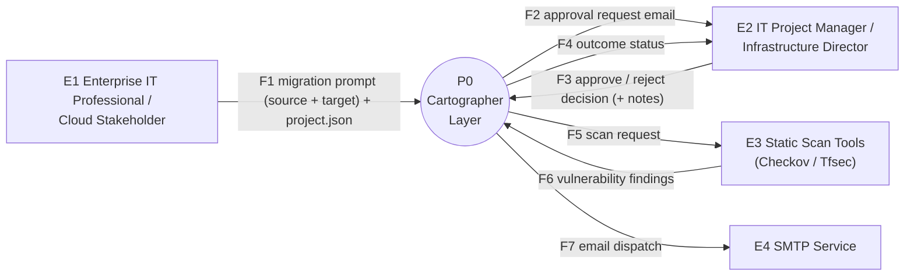
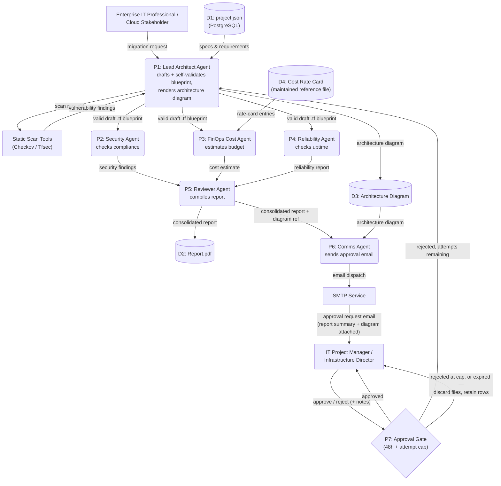
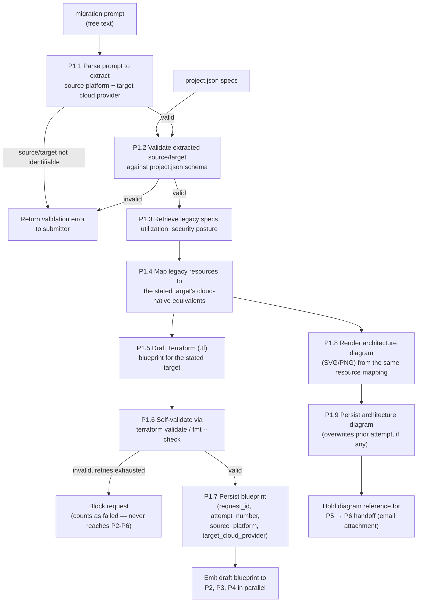
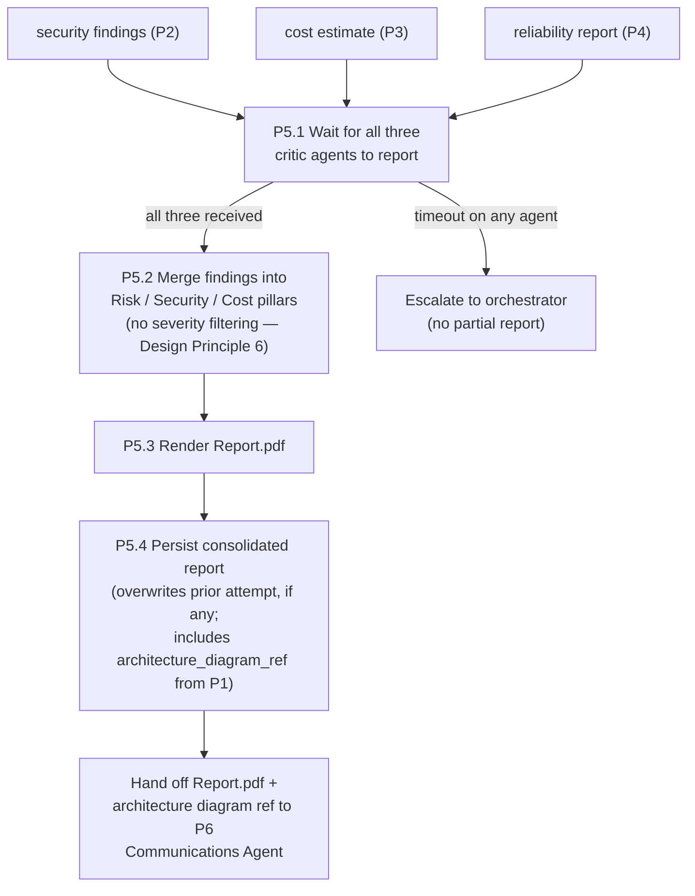
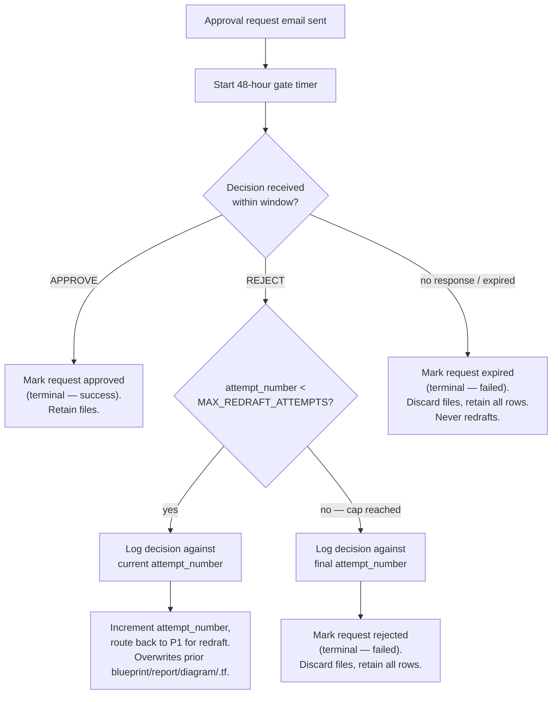

# Cartographer — Data Flow Diagrams (DFD)

**Derived from:** [00-problem-statement.md](00-problem-statement.md) (authoritative — problem + solution). Companion documents: [HLD](02-hld.md) · [LLD](03-lld.md) · [Architecture Diagrams](04-architecture-diagram.md).
**Levels:** L0 (context) → L1 (system decomposition) → L2 (drill-downs of P1, P5, P7).

## 0. Notation

Mermaid cannot draw strict Gane–Sarson symbols; the mapping used throughout:

| DFD element | Rendered as | Naming |
|---|---|---|
| External entity | Rectangle | `E# Name` |
| Process | Rounded node | `P# Name` (L2: `P#.# Name`) |
| Data store | Cylinder | `D# Name` |
| Data flow | Labeled arrow | flow name, defined in the Data Dictionary (§4) |

---

## 1. Level 0 — Context Diagram

The system boundary is the **Cartographer** (Migration Orchestrator + Neuro-SAN agent network + data stores). Everything else is external.

**External entity register**

| ID | Entity | Direction | Notes |
|---|---|---|---|
| E1 | Enterprise IT Professional / Cloud Stakeholder | in | Submits the migration request that starts the workflow |
| E2 | IT Project Manager / Infrastructure Director | in/out | Receives the report, approves/rejects, receives outcome status |
| E3 | Static Scan Tools (Checkov / Tfsec) | in/out | Supplies vulnerability findings to the Security & Compliance Agent |
| E4 | SMTP Service | out | Delivers the approval-request and status emails |

> **Not modeled as external in this release:** a cloud pricing service (FinOps now reads a locally maintained rate-card file — an internal store, not an external system, see D4 below) and a target cloud provider (no live provisioning occurs — see [00 §8](00-problem-statement.md#8-the-phase-gate-trust-model)).

---

## 2. Level 1 — System Decomposition

Every external entity named at L0 reappears here, preserving DFD balancing.

> Note: P2/P3/P4's individual interactions with `project.json` (D1) for reading security posture / utilization data are omitted here for readability and shown in the Level 2 drill-downs where relevant; the diagram above preserves every *external* interface declared at L0 (`IT`, `PM`, `ScanTools`, `SMTPService`), which is the balancing requirement DFD levels must satisfy.

---

## 3. Level 2 Drill-Downs

### 3.1 P1 — Lead Architect Agent

### 3.2 P5 — Executive Reviewer Agent

### 3.3 P7 — Approval Gate

---

## 4. Data Stores

| ID | Store | Contents | Written By | Read By |
|---|---|---|---|---|
| D1 | project.json | Legacy server specs, utilization metrics, security posture (relational, PostgreSQL) | Ingested at request time | P1 |
| D2 | Report.pdf | Consolidated Risk/Security/Cost report for the current attempt only. Deleted from disk on any non-approved terminal outcome; the underlying database row is retained. | P5 (overwrites each attempt) | P6, IT Project Manager (via dashboard, while the file exists) |
| D3 | Architecture Diagram | Rendered SVG/PNG of the mapped target-cloud architecture, for the current attempt only. Deleted from disk on any non-approved terminal outcome; the underlying database row is retained. | P1 (overwrites each attempt) | P5 (reference passthrough), P6 (email attachment), IT Project Manager (via dashboard, while the file exists) |
| D4 | Cost Rate Card | A locally maintained reference file (JSON/CSV) of cloud instance/service rates, used to ground P3's cost estimates. Not a live API; maintained out-of-band by the project team. | Maintained externally by the team | P3 |

> **The Terraform State Store from the prior draft of this document has been removed.** There is no live `terraform apply` in this release, so there is no execution state to track — see [00 §8](00-problem-statement.md#8-the-phase-gate-trust-model) and [ADR-10](02-hld.md#11-design-decisions-adr-summary).

## 5. Data Dictionary (Flows)

| Flow | From → To | Payload |
|---|---|---|
| F1 / migration request | E1 → P1 | Free-text request + `project.json` reference |
| scan request / findings | P1 ↔ E3 | Terraform code out; severity-tagged vulnerability list back |
| draft .tf blueprint | P1 → P2, P3, P4 | Self-validated Terraform code, current attempt number |
| architecture diagram | P1 → D3 | Rendered SVG/PNG, linked to the current attempt |
| rate-card entries | D4 → P3 | Cited unit rates used to ground the cost estimate |
| security findings | P2 → P5 | Severity-tagged vulnerability list, unfiltered |
| cost estimate | P3 → P5 | Monthly cost projection, currency, cited rate-card entry IDs |
| reliability report | P4 → P5 | Redundancy score, notes |
| consolidated report | P5 → D2, P6 | Merged PDF report reference + architecture diagram reference |
| email dispatch | P6 → E4 | Email content + attachments |
| approval request email | E4 → E2 | Email + `Report.pdf` attachment + architecture diagram attachment + dashboard access token |
| approve / reject (+ notes) | E2 → P7 | Decision, approver ID, timestamp, optional rejection notes (fed back to P1 on redraft) |
| outcome status | P7 → E2 | Approved / rejected / expired |

**Flow invariants:**
- A `consolidated report` is only ever produced once security, cost, and reliability findings for the *same* attempt are all present (see §3.2).
- A `rejected` decision with attempts remaining always routes back to P1 with the decision logged first; the previous attempt's blueprint, report, diagram, and `.tf` are overwritten, never versioned alongside the new one.
- An `expired` outcome never routes back to P1, regardless of `attempt_number`.
- A `rejected` decision at the attempt cap is treated identically to `expired`: terminal, files discarded, rows retained.
- An `approval request email` is only dispatched once both the `consolidated report` (P5) and the `architecture diagram` (D3) exist for the *same* attempt — P6 never sends an email with one attachment missing.
- No database row for `migration_request`, `blueprint`, `finding`, `consolidated_report`, or `approval_decision` is ever deleted. Only the physical files referenced by `report_pdf_ref` and `architecture_diagram_ref` are deleted, and only on a non-approved terminal outcome.
