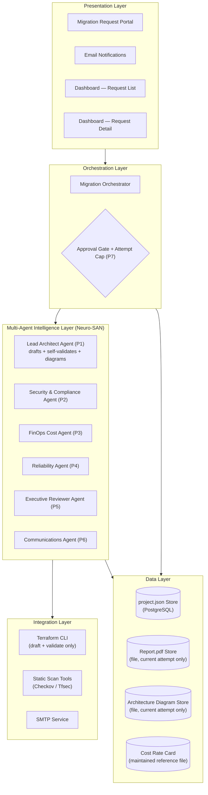
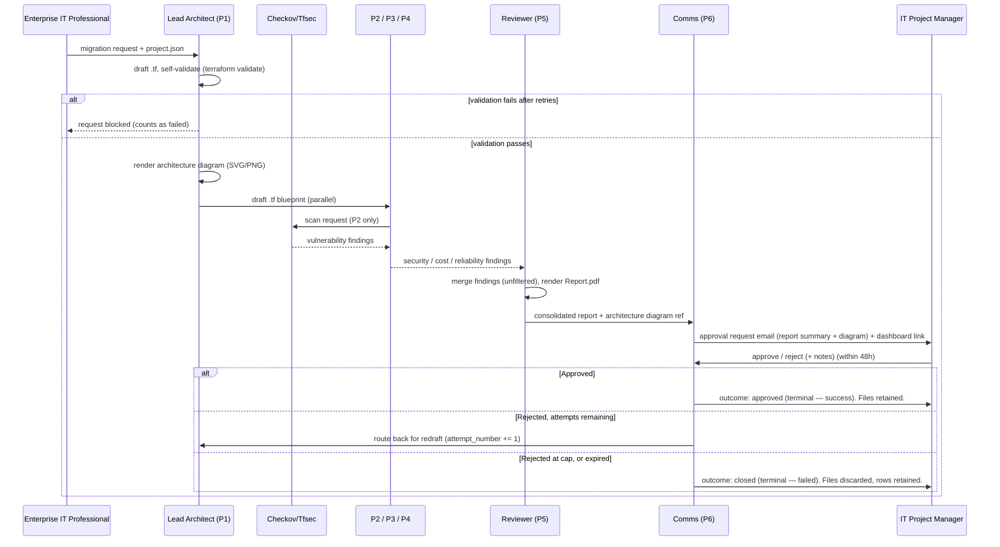

# CI/CD Intelligence Layer — High-Level Design (HLD)

**Derived from:** [00-problem-statement.md](00-problem-statement.md) (authoritative — problem + solution). Companions: [DFD](01-dfd.md) · [LLD](03-lld.md) · [Architecture Diagram](04-architecture-diagram.md).
**Scope:** system-level structure, deployment, integration, data, security, scalability, availability, observability, and the design decisions binding the LLD.

---

## 1. Architecture Goals & Quality Attributes

| # | Quality Attribute | Target | Achieved By |
|---|---|---|---|
| QA1 | Review turnaround | Full analysis (P1–P5) completes without manual intervention | Parallel critic agents (P2, P3, P4) running simultaneously against the same draft |
| QA2 | Human accountability | Zero requests marked successful without an explicit approval | Hard-coded 48-hour Approval Gate (P7); success metric only credits an explicit `approved` decision |
| QA3 | Explainability | Every decision traceable to a report and a named approver, even after files are discarded | Append-only `approval_decision` log (§8); consolidated report retained as a database row |
| QA4 | Scalability | Support multiple concurrent migration requests | Stateless agent invocation per request; no shared mutable state between requests |
| QA5 | Security | 100% of blueprints statically scanned before reaching the Reviewer Agent | Checkov / Tfsec integration inside P2, enforced before P5 can compile a report |
| QA6 | Cost basis integrity | 100% of cost line items cite a maintained rate-card entry | Cost Reference Tool grounding inside P3; no ungrounded LLM figures (see [ADR-7](#11-design-decisions-adr-summary)) |
| QA7 | Bounded rework | Redraft loops never run indefinitely | `MAX_REDRAFT_ATTEMPTS` cap enforced by P7 (default 4, configurable) |
| QA8 | Recoverability of record | A rejected or expired run never loses its decision trail | Decision history retained even when files are discarded (see [ADR-8](#11-design-decisions-adr-summary)) |

## 2. System Context

See [DFD L0](01-dfd.md#1-level-0--context-diagram). Boundary: **Migration Orchestrator + Neuro-SAN agent network (P1–P6) + the P7 approval-gate rule + data stores**. Externals: Enterprise IT Professional / Cloud Stakeholder, IT Project Manager / Infrastructure Director, Static Scan Tools (Checkov/Tfsec), SMTP service. There is no live target-cloud-provider integration in this release.

## 3. Logical Architecture

The system is organized into five layers. Requests flow downward through orchestration and the agent network; results and approvals flow back upward.

> The prior version of this diagram included a sixth "Infrastructure Layer" representing the target cloud provider. It has been removed: this release never contacts the migration target — see [ADR-10](#11-design-decisions-adr-summary). The system's *own* hosting (where the app itself runs) is covered separately in §6, not in this logical view.

### 3.1 Responsibility Matrix

| Layer | Responsibility | Owning Component(s) |
|---|---|---|
| Presentation | Request intake, notification, status viewing | Migration Request Portal, Email, Dashboard (list + detail) |
| Orchestration | Sequencing, gate enforcement, attempt-cap bookkeeping | Migration Orchestrator, Approval Gate (P7) |
| Agent Intelligence | Draft, validate, critique, synthesize | P1–P6 |
| Integration | External/local tool calls | Terraform CLI, Checkov/Tfsec, SMTP |
| Data | Persistence | project.json (PostgreSQL), Report.pdf, Architecture Diagram (files), Cost Rate Card (maintained file) |

## 4. Component Architecture

### 4.1 Migration Orchestrator
Coordinates the sequence: intake → P1 draft + self-validation → parallel critics (P2–P4) → P5 synthesis → P6 notification → P7 gate → terminal outcome (approved / rejected-with-redraft / rejected-at-cap / expired). Enforces that no step starts before its dependencies complete, and that a redraft never exceeds `MAX_REDRAFT_ATTEMPTS`.

### 4.2 Neuro-SAN Agent Network
Hosts P1–P6 as HOCON-configured agents communicating over the AAOSA protocol. Each agent is independently deployable and testable (see [LLD §3](03-lld.md#3-agent-network)). P1 (Lead Architect Agent) produces two linked artifacts per attempt — the Terraform (`.tf`) code and a rendered architecture diagram (SVG/PNG) — both self-validated/rendered and persisted together so downstream agents and the final stakeholder email always reference a matching, current pair.

> **Implementation note — deterministic orchestration (this release).** The Gateway/Orchestrator is the **single source of truth** for persisted findings: after the LLM layer drafts the blueprint, the orchestrator runs each coded tool **exactly once** (security scan, reliability check, rate-card-grounded cost, PDF render) and persists those results. The Neuro-SAN agent network is the **LLM reasoning/draft layer** (P1 drafts the Terraform); the critic agents narrate rather than write the DB, which avoids double-running tools and keeps findings deterministic and testable. If the LLM layer is unavailable, the orchestrator uses a labeled deterministic fallback draft so the pipeline still completes. This is a scope decision for this release, recorded here to match the shipped code.

### 4.3 Approval & Notification Subsystem
P6 (Communications Agent) and P7 (Approval Gate) together implement the trust boundary between automated analysis and human authority. P7 also owns the attempt-cap rule that decides whether a rejection redrafts or closes the request.

> **There is no Deployment Runner / P8 in this release.** The component that previously wrapped `terraform apply` has been removed from scope entirely — approval is a recorded decision, not an execution trigger. See [ADR-10](#11-design-decisions-adr-summary).

## 5. Runtime View

### 5.1 End-to-End Sequence

### 5.2 Stage Latency Budget (Order of Magnitude)

| Stage | Target |
|---|---|
| Blueprint drafting + self-validation (P1) | < 3 minutes |
| Parallel review (P2–P4) | < 5 minutes (runs concurrently) |
| Report synthesis (P5) + email dispatch (P6) | < 2 minutes |
| **Total: request → approval email** | **< 15 minutes** (per success metric in [00 §10](00-problem-statement.md#10-success-metrics)) |
| Approval window (P7) | up to 48 hours (human-paced, not a system bottleneck) |

## 6. Deployment Architecture

### 6.1 Hackathon / MVP Topology
Single-host deployment launched via **`run.ps1`**: the Neuro-SAN server + agent network process (:8080), the FastAPI Gateway/Orchestrator (:8000), and the **React + Vite** dashboard (:5173). Structured data uses **SQLite** by default (Postgres available via `DATABASE_URL`). Generated files (`report.pdf`, `diagram.svg`, `blueprint.tf`) are written to a local `request_response/<request_id>/` folder on the same host (see [LLD §10](03-lld.md#10-deployment-artifacts)). A `deploy/docker-compose.yaml` parity stub describes the Postgres-backed multi-container path.

### 6.2 Production Topology (Target)
Cloud-agnostic containerized deployment: Neuro-SAN agent network and orchestrator as independently scalable services (e.g., Kubernetes pods), a managed Postgres instance for persistence, and the dashboard served as a separate static/SPA deployment. See [Architecture Diagram V5](04-architecture-diagram.md#v5--production-deployment-conceptual).

> **Open item carried forward, not yet resolved:** the hackathon's local-folder file storage does not survive pod restarts or horizontal scale-out. A production deployment needs an actual object/file store (e.g., S3-compatible storage) behind `report_pdf_ref` / `architecture_diagram_ref` — this is noted as a known gap rather than designed further here, since it's out of hackathon scope.

## 7. Security Architecture

- **Role separation:** the person submitting a request can never approve it (see Role-Based Access Summary below).
- **Scan-before-review gate:** P5 cannot compile a report until P2's security scan has completed for the current attempt.
- **Time-boxed authority:** the Approval Gate only accepts a decision within 48 hours of dispatch; expired decisions are rejected outright and never redraft.
- **Least privilege for agents:** each agent service account can read only the inputs it needs and write only its own output record.
- **Approver authentication for the approve/reject action itself is explicitly deferred** for this release (no login flow or link-hijacking mitigation has been designed yet) — flagged as an open item, not resolved here.

### Role-Based Access Summary

| Role | Can Submit Requests | Can Approve/Reject | Can View Reports |
|---|---|---|---|
| Enterprise IT Professional / Cloud Stakeholder | Yes | No | Yes (own requests) |
| IT Project Manager / Infrastructure Director | No | Yes | Yes (all requests) |
| Agent Service Accounts (P1–P6) | No (system-triggered only) | No | Scoped to own inputs/outputs |

## 8. Data Architecture

See the full logical data model in [LLD §8.1](03-lld.md#81-logical-data-model). In summary: a `migration_request` holds **exactly one** current blueprint, one current set of findings, and one current consolidated report — a rejection with attempts remaining overwrites these in place and increments `attempt_number` rather than creating a new version. Every decision made against every attempt (approve or reject) is appended to a persistent `approval_decision` log, so the decision trail survives even when a request's files are later discarded. There is no `deployment_execution` entity in this release.

## 9. Scalability, Performance, Availability

- **Scalability:** agents are stateless per invocation; concurrent migration requests do not share mutable state, enabling horizontal scaling of the agent network.
- **Performance:** parallelizing P2–P4 keeps the analysis phase near the slowest single critic agent rather than the sum of all three.
- **Availability:** the orchestration and notification layers should remain available at least during business hours; the 48-hour gate is tolerant of short outages since it is measured from dispatch time, not continuous uptime.

## 10. Observability

- Every state transition (`received`, `drafting`, `blocked`, `in_review`, `reported`, `approved`, `rejected`, `expired`) is logged with a timestamp, `request_id`, and `attempt_number`.
- Agent-level failures (e.g., validation failure, scan tool timeout) are logged distinctly from business-logic outcomes (rejection, expiry) so operational issues can be distinguished from expected gate outcomes.
- The redraft loop logs each attempt's outcome distinctly, so a request that took 3 redraft attempts before approval is fully reconstructable from the `approval_decision` log even though only the final attempt's files remain on disk.

## 11. Design Decisions (ADR Summary)

| # | Decision | Rationale | Alternatives Considered |
|---|---|---|---|
| ADR-1 | Run P2, P3, P4 in parallel, not sequentially | Cuts analysis time roughly to the slowest single check instead of the sum of three | Sequential team-by-team review (status quo — rejected as too slow) |
| ADR-2 | Fixed 48-hour approval window | Balances giving humans enough time to review against indefinite drift | Unlimited approval window (rejected — risks stale decisions); shorter window (rejected — insufficient for cross-team sign-off) |
| ADR-3 | Terraform as the sole IaC drafting format | Broad multi-cloud provider support, mature ecosystem, widely understood by reviewers | Cloud-native templates (CloudFormation/ARM) — rejected for lock-in |
| ADR-4 | A rejection with attempts remaining returns to P1; an expiry or a rejection at the attempt cap does not | Bounds automatic rework while still giving genuinely fixable issues a chance to be corrected, without ever letting a stale or repeatedly-rejected request loop forever | Always redraft regardless of cap (rejected — unbounded loop risk); never redraft, always terminate on any reject (rejected — throws away easily-correctable drafts) |
| ADR-5 | `project.json` and all derived records are stored in PostgreSQL (relational), not a vector DB | P1 needs exact, schema-validated extraction and strong cross-agent consistency; there is no similarity-search requirement over this data | Vector DB / embeddings store (rejected — wrong retrieval model for structured, schema-validated input) |
| ADR-6 | P1 renders an architecture diagram (SVG/PNG) alongside the Terraform blueprint, from the same resource mapping | Gives the approver a visual, human-readable artifact rather than requiring them to read raw `.tf` code before deciding | Text-only summary in Report.pdf (rejected — insufficient for a non-technical approver to visually verify the design) |
| ADR-7 | FinOps cost estimation is LLM-driven, grounded by a locally maintained rate-card file, not a live Cloud Pricing API | Removes an external credentialed dependency; keeps the estimate inspectable via cited rate-card entries rather than an opaque API response | Live pricing API (rejected for this release — adds an external dependency not otherwise needed); fully unconstrained LLM estimate with no reference (rejected — no verifiable basis) |
| ADR-8 | One blueprint, report, and diagram per migration request — overwritten in place across redraft attempts, not versioned | Matches the decision that files are disposable on non-approval; avoids storing content for attempts that were explicitly rejected | Full version history per attempt (rejected for this scope — unnecessary storage and complexity given files are discarded on non-approval anyway) |
| ADR-9 | Capped redraft loop (`MAX_REDRAFT_ATTEMPTS`, default 4, configurable) with automatic close on cap exhaustion or expiry | Bounds rework time and keeps request lifecycle predictable | Unlimited redraft attempts (rejected — could loop indefinitely); zero redraft, always terminal on first reject (rejected — loses the chance to fix an easily-correctable issue) |
| ADR-10 | No deployment runner / live provisioning in this release | Hackathon scope is analysis and a gated recommendation, not live infrastructure change; approval is a recorded decision and success-metric flag only | Include a simulated `terraform apply` subprocess (rejected — risks implying a live-execution capability the system does not actually have) |
| ADR-11 | P1 self-validates its Terraform draft (`terraform validate` / `fmt --check`) before fan-out to P2–P4 | Prevents syntactically invalid HCL from reaching Checkov/Tfsec, which assume valid input | Rely on critic agents to surface syntax issues (rejected — scanners are not designed to validate syntax and may fail ungracefully on malformed input) |

## 12. Risks & Mitigations

| Risk | Mitigation |
|---|---|
| Critic agent produces a false negative (misses a real vulnerability) | Findings are advisory input to a human decision, not an automatic pass/fail (Design Principle 6) |
| Cost rate-card file becomes stale or outdated | Every cost estimate cites the specific rate-card entry used; the rate-card's last-updated date is surfaced alongside the estimate so the approver can judge freshness |
| LLM-estimated cost diverges from the rate-card (hallucinated figures) | P3's tool call requires citing a real rate-card entry ID; an estimate citing a non-existent ID is rejected and retried rather than passed through |
| Approver misses the 48-hour window | Expiry is a clean, immediate terminal state (failed) with no ambiguity — no silent discard, no partial state |
| Redraft loop exhausts all attempts without resolving the underlying rejection reason | Each redraft carries the approver's rejection notes forward to P1 as explicit feedback; exhausting the cap is clearly surfaced as a terminal, visible outcome on the dashboard, not silently dropped |
| Malformed Terraform reaches a critic agent | P1's self-validation step blocks the request before hand-off if validation fails after retries (ADR-11) |

## 13. Technology Stack

See [00-problem-statement.md §9](00-problem-statement.md#9-technology-stack) for the authoritative stack table (Neuro-SAN, AAOSA, single NVIDIA NIM model, Checkov/Tfsec, ReportLab, SMTP, React + Vite, SQLite/Postgres, Terraform drafting/validation only).
