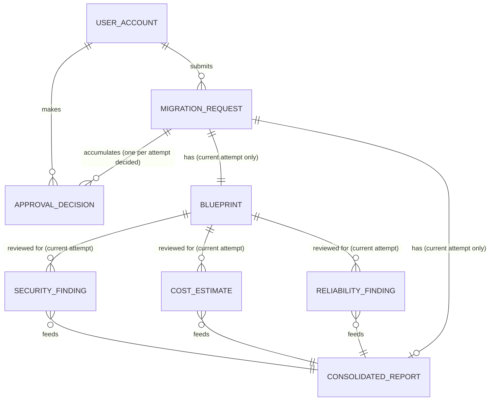

# Cartographer — Low-Level Design (LLD)

**Derived from:** [00-problem-statement.md](00-problem-statement.md) · [02-hld.md](02-hld.md) (authoritative structure). Companions: [DFD](01-dfd.md) · [Architecture Diagram](04-architecture-diagram.md).

---

## 0. Document Control

| Field | Value |
|---|---|
| **Purpose** | Translate the approved HLD into implementation-ready detail: data model, entity fields, module logic, API contracts, step-by-step flows, error handling, dashboard specification, and test scope. |
| **Scope** | Covers the full agent network (P1–P6), the Migration Orchestrator, the Approval Gate (P7) and its attempt-cap logic, all internal data stores, integration contracts with external services, and the two-page dashboard. Excludes any live provisioning against a target cloud provider — out of scope for this release. |
| **Assumptions** | The HLD has been reviewed and approved. `project.json` is the sole structured input format accepted by P1. Terraform is the sole IaC drafting format for this release, used for drafting and self-validation only — never applied. |
| **Audience** | Backend/platform engineers implementing the agents and orchestrator, QA engineers, API consumers, dashboard/frontend engineers, and technical reviewers. |

## 1. Project Layout (Proposed)

```
ci-cd-intelligence-layer/
├── registries/
│   └── migration_intelligence.hocon      # Neuro-SAN agent network definition
├── coded_tools/
│   ├── terraform_validate_tool.py         # terraform validate / fmt --check wrapper
│   ├── diagram_render_tool.py              # Mermaid CLI / Graphviz wrapper
│   ├── security_scan_tool.py              # Checkov / Tfsec wrapper
│   ├── cost_reference_tool.py              # Reads the maintained rate-card file
│   ├── reliability_check_tool.py
│   ├── report_render_tool.py              # ReportLab PDF renderer
│   └── smtp_dispatch_tool.py
├── config/
│   └── cost_rate_card.json                # Maintained cost reference data (see §5)
│                                          # (llm_config is inlined in the registry, §6)
├── gateway/
│   ├── api/                               # REST endpoints (see §7)
│   └── invoker/neuro_san_client.py
├── database/
│   ├── schema.py                          # SQLAlchemy models (see §8)
│   └── db_session.py                      # engine/session; create_all + seed on startup
├── request_response/                      # Generated files, one folder per request (see §10)
│   └── <request_id>/
│       ├── blueprint.tf
│       ├── report.pdf
│       └── diagram.svg
├── dashboard-web/                         # React + Vite SPA — two pages (see §9)
├── deploy/
│   ├── docker-compose.yaml                # hackathon topology
│   └── k8s/                               # production manifests
└── tests/
```

> The `deploy/k8s/` production manifests and this project layout intentionally omit any Terraform-apply execution path, a deployment-runner service, or object storage wiring — all out of scope for this release (see [HLD §6.2](02-hld.md#62-production-topology-target) for the storage caveat carried forward as an open item).

## 2. Runtime Configuration

### 2.1 Environment Variables

| Variable | Purpose |
|---|---|
| `NEURO_SAN_URL` | Base URL of the running Neuro-SAN server |
| `LLM_PROVIDER_PRIMARY` | Primary LLM provider identifier (e.g., `openai`, `anthropic`) |
| `SMTP_HOST` / `SMTP_PORT` / `SMTP_CREDENTIALS` | Outbound email configuration |
| `APPROVAL_WINDOW_HOURS` | Defaults to `48`; governs P7 |
| `MAX_REDRAFT_ATTEMPTS` | Defaults to `4`; governs how many times a manual rejection may send a request back to P1 before it closes as terminal-failed |
| `SUPPORTED_CLOUD_PROVIDERS` | Comma-separated allow-list, e.g. `aws,azure,gcp` — P1 rejects a prompt naming a target outside this list rather than guessing |
| `DIAGRAM_OUTPUT_FORMAT` | Output format for P1's rendered architecture diagram; `svg` (default) or `png` |
| `DIAGRAM_RENDER_ENGINE` | Which rendering backend to invoke: `mermaid_cli` or `graphviz` |
| `COST_RATE_CARD_PATH` | Filesystem path to the maintained cost rate-card file read by `cost_reference_tool` |
| `REQUEST_RESPONSE_ROOT` | Root folder for per-request generated files (default `./request_response/`) |

> **Removed from the prior draft:** `CLOUD_PRICING_API_KEY`. There is no live pricing API in this release — see [ADR-7](02-hld.md#11-design-decisions-adr-summary).

### 2.2 Network-Level HOCON Keys

| Key | Value Chosen | Why |
|---|---|---|
| `max_parallel_agents` | `3` | Matches the P2/P3/P4 fan-out; avoids over-provisioning agent workers |
| `agent_timeout_seconds` | `300` | Long enough for LLM + tool round trips; short enough to trigger the P5 escalation path on a stuck critic |
| `retry_policy` | `exponential_backoff(3, base=2s)` | Matches the retry behavior in [§12](#12-error-handling--transaction-control) |

## 3. Agent Network — `registries/migration_intelligence.hocon`

Illustrative structure (not a full working file):

```hocon
{
  "llm_config": { "model_name": "gpt-4o" }
  "tools": [
    {
      "name": "lead_architect_agent"
      "function": { "description": "Drafts the initial Terraform blueprint, self-validates it, and renders an architecture diagram from project.json" }
      "instructions": "Map legacy resources to cloud-native equivalents, draft .tf code, call terraform_validate_tool before proceeding, and render an architecture diagram (SVG/PNG) from the same resource mapping. On redraft, incorporate the prior rejection notes."
      "coded_tool": ["terraform_validate_tool", "diagram_render_tool"]
      "downstream_tools": ["security_compliance_agent", "finops_cost_agent", "reliability_agent"]
    }
    {
      "name": "security_compliance_agent"
      "function": { "description": "Scans the draft blueprint via Checkov/Tfsec" }
      "coded_tool": "security_scan_tool"
      "downstream_tools": ["executive_reviewer_agent"]
    }
    {
      "name": "finops_cost_agent"
      "function": { "description": "Estimates monthly cost, grounded in the maintained cost rate-card file" }
      "coded_tool": "cost_reference_tool"
      "downstream_tools": ["executive_reviewer_agent"]
    }
    {
      "name": "reliability_agent"
      "coded_tool": "reliability_check_tool"
      "downstream_tools": ["executive_reviewer_agent"]
    }
    {
      "name": "executive_reviewer_agent"
      "function": { "description": "Merges findings unfiltered and renders Report.pdf" }
      "coded_tool": "report_render_tool"
      "downstream_tools": ["communications_agent"]
    }
    {
      "name": "communications_agent"
      "coded_tool": "smtp_dispatch_tool"
    }
  ]
}
```

> P7 (the approval gate and attempt-cap rule) is deliberately **not** a Neuro-SAN agent in this registry — it is deterministic orchestrator logic, not an LLM call. See [HLD §4.3](02-hld.md#43-approval--notification-subsystem).

## 4. Data Contracts (JSON Schemas, Summarized)

### 4.1 `migration_request`
```json
{
  "request_id": "uuid",
  "submitted_by": "uuid",
  "prompt": "string — free text; must state source platform and target cloud provider (e.g. \"Migrate our on-prem Oracle cluster to AWS\")",
  "project_json_ref": "string",
  "submitted_at": "timestamp",
  "attempt_number": "int — current draft attempt, starts at 1, capped at MAX_REDRAFT_ATTEMPTS",
  "status": "received | drafting | blocked | in_review | reported | approved | rejected | expired"
}
```
The `prompt` field is the sole source of the source-platform/target-cloud-provider pairing — there is no separate dropdown or config field for this. P1 is responsible for extracting both from it (see [DFD §3.1, P1.1](01-dfd.md#31-p1--lead-architect-agent)).

**Status semantics:**
- `blocked` — P1's self-validation or diagram rendering failed after retries; the request never reached a critic agent or an approver. Counts as **failed** for the success metric.
- `rejected` — a manual rejection was received while `attempt_number == MAX_REDRAFT_ATTEMPTS`. Terminal, failed. (A rejection at a *lower* attempt number does not set this status — it increments `attempt_number` and returns the request to `drafting` instead.)
- `expired` — the 48-hour window elapsed with no decision. Terminal, failed. Never transitions through a redraft.
- `approved` — terminal, success.

### 4.2 `blueprint`
```json
{
  "blueprint_id": "uuid",
  "request_id": "uuid",
  "attempt_number": "int — mirrors migration_request.attempt_number at the time this row was written",
  "source_platform": "string — extracted by P1 from the prompt (e.g. oracle, mssql, db2)",
  "target_cloud_provider": "aws | azure | gcp — extracted by P1 from the prompt; used only to select a Terraform provider block, never to contact a live provider",
  "terraform_code_ref": "string — path to the current attempt's .tf file",
  "architecture_diagram_ref": "string — path/URL to the current attempt's rendered SVG/PNG",
  "validated_at": "timestamp — when terraform_validate_tool last passed",
  "drafted_at": "timestamp"
}
```
There is exactly **one** `blueprint` row per `migration_request` (see [ADR-8](02-hld.md#11-design-decisions-adr-summary)) — a redraft **updates this row in place** (new `terraform_code_ref`, `architecture_diagram_ref`, `attempt_number`, `drafted_at`), it does not insert a new row. `source_platform` and `target_cloud_provider` are P1's resolved output, not request-time input — they are derived once per attempt so P2–P4 all read the same resolved values rather than re-parsing the prompt themselves.

### 4.3 `security_finding` / `cost_estimate` / `reliability_finding`
```json
{
  "finding_id": "uuid",
  "blueprint_id": "uuid",
  "severity": "low | medium | high | critical",
  "description": "string",
  "scanned_at": "timestamp"
}
```
```json
{
  "estimate_id": "uuid",
  "blueprint_id": "uuid",
  "monthly_cost": "decimal",
  "currency": "ISO-4217 code",
  "rate_card_refs": "array of strings — the specific rate-card entry IDs cited for each line item",
  "generated_at": "timestamp"
}
```
```json
{
  "finding_id": "uuid",
  "blueprint_id": "uuid",
  "redundancy_score": "int (0-100)",
  "notes": "string",
  "validated_at": "timestamp"
}
```
All three are scoped to the *current* `blueprint_id`. On a redraft, the prior attempt's rows are replaced (delete-and-reinsert) rather than accumulated, since they describe a draft that no longer exists.

### 4.4 `consolidated_report`
```json
{
  "report_id": "uuid",
  "blueprint_id": "uuid",
  "report_pdf_ref": "string — path to the current attempt's Report.pdf",
  "architecture_diagram_ref": "string — copied from blueprint.architecture_diagram_ref at compile time, so P6 can attach both files without a second lookup",
  "compiled_at": "timestamp"
}
```
Like `blueprint`, there is exactly **one** `consolidated_report` row per `migration_request`, overwritten in place on each redraft.

### 4.5 `approval_decision`
```json
{
  "decision_id": "uuid",
  "request_id": "uuid",
  "attempt_number": "int — which attempt this decision was made against",
  "approver_id": "uuid",
  "decision": "approved | rejected",
  "rejection_notes": "string | null — fed back to P1 as redraft context when decision is rejected and attempts remain",
  "decided_at": "timestamp"
}
```
Unlike `blueprint` and `consolidated_report`, this table is **append-only** — every decision made against every attempt is kept permanently, even after that attempt's files are gone. This is what preserves a full audit trail (Design Principle 4) despite the file-overwrite/discard model. A request that took three rejections before being approved has three `approval_decision` rows even though only the final, approved attempt's files exist on disk.

> **`deployment_execution` has been removed from this release.** There is no deployment runner and no live provisioning — see [ADR-10](02-hld.md#11-design-decisions-adr-summary).

## 5. Coded Tools

| Tool | Used By | Purpose |
|---|---|---|
| `terraform_validate_tool` | P1 | Runs `terraform validate` / `fmt --check` against the freshly drafted `.tf`; retried with backoff, blocks the request if still failing |
| `diagram_render_tool` | P1 | Renders the mapped resource graph into an architecture diagram (SVG/PNG) via Mermaid CLI or Graphviz |
| `security_scan_tool` | P2 | Wraps Checkov / Tfsec CLI invocations against the validated `.tf` code |
| `cost_reference_tool` | P3 | Reads `COST_RATE_CARD_PATH`, returns matching rate-card entries for P3 to cite; rejects an estimate that cites an entry ID not present in the file |
| `reliability_check_tool` | P4 | Evaluates redundancy/backup configuration in the blueprint |
| `report_render_tool` | P5 | Renders the merged findings into `Report.pdf` via ReportLab, unfiltered by severity |
| `smtp_dispatch_tool` | P6 | Sends the approval-request and outcome emails via the configured SMTP host |

> **Removed:** `cloud_pricing_tool` (replaced by `cost_reference_tool` — no live API, see [ADR-7](02-hld.md#11-design-decisions-adr-summary)) and `terraform_apply_tool` (no deployment runner in this release, see [ADR-10](02-hld.md#11-design-decisions-adr-summary)).

## 6. LLM Configuration

**Decision (this release): a single LLM model backs every agent — not a per-agent model split.**
All agents (P1–P6) inherit one network-level `llm_config` using an **NVIDIA NIM** model
(default `mistralai/mistral-small-4-119b-2603`, overridable via `NVIDIA_NIM_MODEL`).
This is set once at the top of `registries/migration_intelligence.hocon` (inlined, not a
cross-tree include — those fail to resolve in the neuro-san server); no agent overrides its model. Rationale:
one credentialed provider to manage, consistent behavior across agents, and it matches
the verified deployment. `NVIDIA_API_KEY` is read from the environment.

| Agent | Model |
|---|---|
| P1 Lead Architect | NVIDIA NIM (single shared model) |
| P2 Security & Compliance | NVIDIA NIM (single shared model) |
| P3 FinOps Cost | NVIDIA NIM (single shared model) |
| P4 Reliability | NVIDIA NIM (single shared model) |
| P5 Executive Reviewer | NVIDIA NIM (single shared model) |
| P6 Communications | NVIDIA NIM (single shared model) |

> The original draft assigned different GPT-4o / Claude models per agent. That per-agent
> split was retired for this release in favor of one NVIDIA NIM model for all agents.

## 7. Gateway API

*Endpoint paths are intentionally left blank — populate once base paths/API keys are finalized.*

| API ID | API Name | Method | Endpoint | Request Payload (Summary) | Response Payload (Summary) |
|---|---|---|---|---|---|
| API-01 | Submit Migration Request | POST | | `submitted_by`, `project_json_ref`, `prompt` | `request_id`, `status` |
| API-02 | Get Request Status | GET | | `request_id` | `status`, `stage` (live sub-step: drafting/validating/diagram/scanning/reliability/costing/reporting/gated — drives the animated agent-network graph), `attempt_number`, `max_redraft_attempts` |
| API-03 | Get Blueprint Detail | GET | | `request_id` | `terraform_code_ref`, `architecture_diagram_ref`, `attempt_number`, `drafted_at` |
| API-04 | Get Consolidated Report | GET | | `request_id` | `report_pdf_ref`, `architecture_diagram_ref`, `compiled_at`, structured findings summary (see §9.3) |
| API-05 | Submit Approval Decision | POST | | `request_id`, `approver_id`, `decision`, `rejection_notes` (optional) | `decision_id`, `decided_at`, resulting `status`, `attempt_number` |
| API-06 | List Migration Requests | GET | | filters: `status`, `risk_band`, `decision` | list of requests for the dashboard list page (see §9.1) |
| API-07 | List Pending Approvals | GET | | `approver_id` | list of `request_id` + summary, scoped to reports awaiting a decision |

> **Removed from the prior draft:** `Get Deployment Status` (no deployment runner — see [ADR-10](02-hld.md#11-design-decisions-adr-summary)) and `Resubmit Rejected Blueprint` (redraft is now an automatic system reaction to a REJECT decision under API-05, not a separate user-invoked action).

## 8. Database Schema (Recommended Tables)

All tables below live in a single relational database managed via SQLAlchemy (see [ADR-5](02-hld.md#11-design-decisions-adr-summary)) — **SQLite by default for dev/hackathon, PostgreSQL in production via `DATABASE_URL`** (same schema either way). `project.json` is schema-validated at API-01 (Pydantic) before any row is written; its file is stored under the request folder and referenced via `migration_request.project_json_ref`, and the resolved source/target + findings are persisted as structured fields rather than embedded into a vector store.

| Table | Primary Key | Purpose | Row lifecycle |
|---|---|---|---|
| `user_account` | `user_id` | Identity, role, contact info for stakeholders, approvers, admins | Permanent |
| `migration_request` | `request_id` | Each incoming request, its source reference, current attempt number, and status | Permanent — never deleted |
| `blueprint` | `blueprint_id` | The current Terraform blueprint and its linked architecture diagram reference, for the current attempt only | One row per request, **overwritten in place** on redraft |
| `security_finding` / `cost_estimate` / `reliability_finding` | `finding_id` / `estimate_id` / `finding_id` | Scan/estimate results for the current attempt | Replaced (delete-and-reinsert) on redraft |
| `consolidated_report` | `report_id` | Merged report for the current attempt | One row per request, **overwritten in place** on redraft |
| `approval_decision` | `decision_id` | Every approve/reject decision made against every attempt | **Append-only — permanent, never overwritten or deleted** |

> **`deployment_execution` has been removed.** No live provisioning occurs in this release.

### 8.1 Logical Data Model



**What changed here, and why:**
- `MIGRATION_REQUEST ||--|| BLUEPRINT` is now a correct, strict 1:1 — under the overwrite model (ADR-8), this is no longer the versioning-contradiction it was in the prior draft; it's an accurate description of "one current blueprint per request."
- `MIGRATION_REQUEST ||--o{ APPROVAL_DECISION` is one-to-*many* rather than the prior draft's mandatory report→decision 1:1, because a single request can accumulate several logged decisions across redraft attempts, and a `blocked` request may have zero decisions at all (it never reached an approver).
- `MIGRATION_REQUEST ||--o| CONSOLIDATED_REPORT` is zero-or-one rather than mandatory, since a `blocked` request never produces a report.
- `deployment_execution` and its relationships have been removed entirely (no live provisioning in this release).

## 9. Dashboard

Two pages only: a request list, and a per-request detail view. There is **no aggregate approval/rejection percentage anywhere in the UI** — the request-success metric (see [00 §10](00-problem-statement.md#10-success-metrics)) is computed and reported separately, not surfaced as a dashboard statistic.

### 9.1 Page 1 — Request List

Shows every migration request, including ones currently in progress. Columns:

| Column | Source | Notes |
|---|---|---|
| Request | `migration_request.request_id` + `blueprint.source_platform → blueprint.target_cloud_provider` | e.g. `oracle → aws` |
| State | `migration_request.status` | `received / drafting / blocked / in_review / reported / approved / rejected / expired`; in-progress states render with a live indicator |
| Risk band | Derived (see §9.4) | `low / medium / high / critical` |
| Decision | Derived from latest `approval_decision` for the request, or `pending` if none yet / still in progress | `pending / approved / rejected` |
| Created | `migration_request.submitted_at` | |

Filters: by state, by risk band, by decision — mirroring the columns above.

**Rejected / expired rows:** once a request's files have been discarded (`status = rejected` or `status = expired`), its row remains on the list (the database row is never deleted) but is **not clickable**. An inline note next to the row reads *"rejected — no report available"* (or the expired equivalent), rather than opening a detail page with nothing to show.

### 9.2 Page 2 — Request Detail

Opens when a clickable row (any state other than the discarded-file terminal states above) is selected. Contains:

1. **Live agent-network graph** — a single custom-rendered SVG (`AgentFlow`) mirroring the P1→(P2/P3/P4)→P5→P6→P7 topology. Edges animate (flowing dataflow) into the currently-working node and the active node pulses, driven by the `stage` field from API-02 (drafting→P1, scanning/costing/reliability→P2/P3/P4, reporting→P5, gated→P7). The same graph settles on terminal states (approved = P7 green, rejected/expired = P7 red, blocked = failed step red). This one graph serves both the in-progress and completed views.
2. **Findings summary panel** — a structured, styled summary of the consolidated report, **not an embedded raw PDF viewer**. Rows for: security (severity counts + worst finding), cost (monthly estimate + cited rate-card basis), reliability (redundancy score + notes), and the decision/policy line (current status, attempt number, and — once decided — the approver and any rejection notes). The underlying `Report.pdf` still exists as a file and is offered as a separate download link alongside the summary.
3. **Architecture diagram** — the current attempt's rendered SVG/PNG, shown inline.
4. **Terraform link** — a download/view link to the current attempt's `.tf` file.

### 9.3 Findings Summary Panel — Field Mapping

| Panel row | Source |
|---|---|
| Security | `security_finding` rows for the current `blueprint_id`: count by severity, plus the highest-severity finding's description |
| Cost | `cost_estimate.monthly_cost` + `cost_estimate.rate_card_refs` |
| Reliability | `reliability_finding.redundancy_score` + `.notes` |
| Decision / policy | `migration_request.status`, `migration_request.attempt_number`, most recent `approval_decision` (if any) |

### 9.4 Risk Band — Derivation

There is no live scoring service in this release; the risk band shown on both pages is a simple, documented rule rather than an invented formula:

1. Take the highest severity present across the current attempt's `security_finding` rows (`low / medium / high / critical`).
2. Map the current `reliability_finding.redundancy_score` onto the same four-level scale using the following illustrative default thresholds (tune as needed — these are starting points, not hard requirements): `≥ 80 → low`, `60–79 → medium`, `30–59 → high`, `< 30 → critical`.
3. The displayed band is the **worse** of the two.

Cost does not currently feed into the risk band — `cost_estimate` has no severity concept in this schema (it's a number with a cited basis, not a graded finding). If cost should factor into the band later (e.g., a variance-from-budget threshold), that needs its own explicit rule and is called out here as a deliberate gap rather than silently ignored.

### 9.5 Explicitly deferred (not built in this release)

- A manual "redraft now" / rerun action — redraft is purely automatic, triggered by a REJECT decision under the attempt cap.

> **Launch page** supports two input modes: a guided template (source/target dropdowns) or a direct **`project.json` file upload** — the uploaded specification is validated at API-01 and flows through the entire pipeline (P1 resolution, critics, cost grounding, diagram) for that request.
- Approver authentication UI (login, token issuance) — the approve/reject action's auth flow is not designed yet (see [HLD §7](02-hld.md#7-security-architecture)).
- Any aggregate success/failure percentage displayed in the UI.

## 10. Deployment Artifacts

### 10.1 Hackathon (`deploy/docker-compose.yaml`, illustrative)
```yaml
services:
  neuro-san:
    image: neuro-san:latest
    ports: ["8080:8080"]
  orchestrator:
    build: ./gateway
    depends_on: [neuro-san, db]
    volumes:
      - ./request_response:/app/request_response
  db:
    image: postgres:16
    environment:
      POSTGRES_DB: cicd_intelligence
  dashboard:
    build: ./dashboard
    depends_on: [orchestrator]
```

### 10.2 Production (`deploy/k8s/`)
Separate Deployments for the Neuro-SAN agent network, the Gateway/Orchestrator, and the Dashboard; a managed Postgres instance; Horizontal Pod Autoscaler on the Orchestrator and agent network pods. As noted in [HLD §6.2](02-hld.md#62-production-topology-target), the hackathon's local-folder file storage does not carry over to this topology without an actual object store behind it — flagged as an open item, not designed further here.

## 11. Testing Strategy

| Test Type | Scope | Representative Cases |
|---|---|---|
| Unit | Individual agent logic (P1–P6) with mocked inputs/outputs | Blueprint drafting from a valid `project.json`; `terraform_validate_tool` rejecting malformed HCL; architecture diagram rendering; severity classification in P2; `cost_reference_tool` rejecting a citation to a non-existent rate-card entry |
| Integration | Agent-to-agent handoffs and tool calls | P1 → P2/P3/P4 fan-out only after validation passes; P6 → SMTP dispatch |
| Contract | API request/response schemas against §7 | API-01 rejects missing `project_json_ref`; API-05 rejects an invalid decision enum |
| End-to-End | Full workflow, request to terminal outcome | Happy path: submission → approval (files retained); rejection-with-redraft path: submission → reject → redraft (attempt 2) → approval; attempt-cap path: submission → reject ×`MAX_REDRAFT_ATTEMPTS` → closed (files discarded, rows retained); expiry path: submission → no decision within 48h → closed immediately, no redraft attempted; blocked path: malformed draft fails validation after retries → request blocked before reaching P2–P6 |
| Negative / Failure | Error handling and transaction control | Scan tool downtime → blocked status; rate-card file missing/unreadable → P3 blocked; expired approval window rejected outright; a reject received exactly at `attempt_number == MAX_REDRAFT_ATTEMPTS` closes rather than redrafting |
| Concurrency | Multiple simultaneous requests/redrafts | Two decision submissions racing on the same request — only one decision is logged and honored per attempt |
| Security | RBAC enforcement and data scoping | A Cloud Stakeholder cannot call API-05; an approver only sees reports scoped to their organization |
| Dashboard | UI behavior specific to this release | A rejected/expired row renders non-clickable with the correct inline note; the detail page's findings panel never embeds a raw PDF; the agent-network graph updates live and settles correctly on terminal states; no aggregate approval/rejection percentage appears anywhere in the UI |
| Performance | Throughput/latency vs. NFR targets | 10 concurrent migration requests complete parallel review within target time |

## 12. Error Handling & Transaction Control

| Scenario | Error Handling Strategy | Transaction Control |
|---|---|---|
| Malformed `project.json` on submission | Reject at API-01 with a structured validation error; no downstream records created | No `migration_request` row committed until payload passes schema validation |
| P1's generated Terraform fails `terraform_validate_tool` | Retry with exponential backoff (3 attempts, 2s/4s/8s); if still failing, set status `blocked` and stop — never hands off to P2–P4 | `blueprint` row is not marked valid/handed off until validation succeeds; a blocked attempt counts as failed for the success metric |
| Scan tool (Checkov/Tfsec) unreachable | Retry with exponential backoff (3 attempts, 2s/4s/8s); flag blueprint as blocked after final failure | `security_finding` insert is atomic; a failed scan never leaves a partial row |
| Cost rate-card file missing, unreadable, or a cited entry ID doesn't exist in it | Retry once (transient read failure); on a genuine missing/invalid reference, block P3's contribution and escalate rather than fabricate a figure | `cost_estimate` written in a single insert only once a valid, cited estimate is produced |
| Critic agent fails to report in time | P5 escalates to orchestrator instead of compiling a partial report | `consolidated_report` is only written once all three finding sets exist for the same `blueprint_id`/attempt |
| SMTP dispatch failure | Retry up to 3 times over 15 minutes; fall back to in-dashboard notification | Approval Gate timer starts only after successful dispatch or fallback |
| Manual reject received while `attempt_number < MAX_REDRAFT_ATTEMPTS` | Log the decision; increment `attempt_number`; route back to P1; overwrite `blueprint`/`consolidated_report` in place | Decision insert and the attempt-number increment happen in a single transaction |
| Manual reject received while `attempt_number == MAX_REDRAFT_ATTEMPTS` | Log the decision as final; set `migration_request.status = rejected`; delete the request's files from `request_response/<request_id>/`; retain all database rows | Status update and the decision-log insert happen in a single transaction; file deletion happens after the transaction commits |
| Approval decision received after the 48-hour window | Reject as expired; set `migration_request.status = expired`; delete the request's files; retain all database rows; never redraft, regardless of `attempt_number` | `approval_decision` insert is rejected by application logic if `decided_at` exceeds the window; the expiry-close transition is independent of any late decision attempt |
| Concurrent decision submissions on the same request | Enforce optimistic locking on `migration_request.attempt_number` | Only the first decision to commit is honored; the second is rejected as stale |
