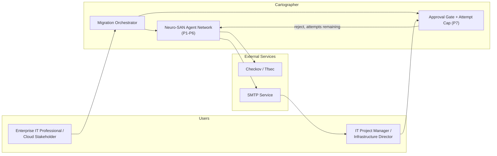
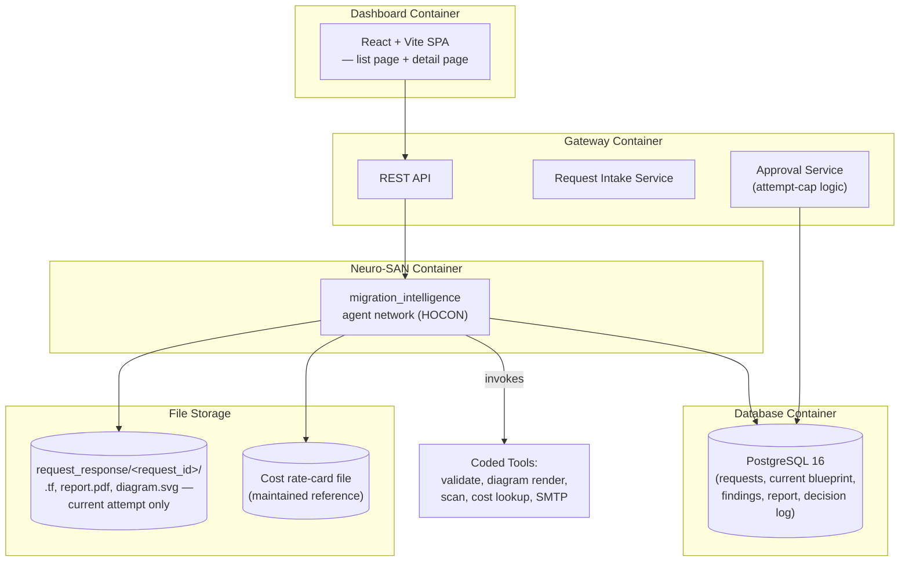
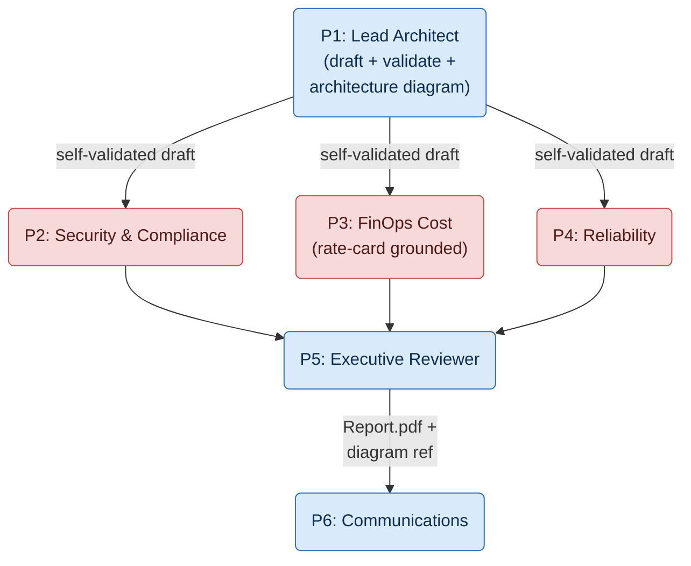
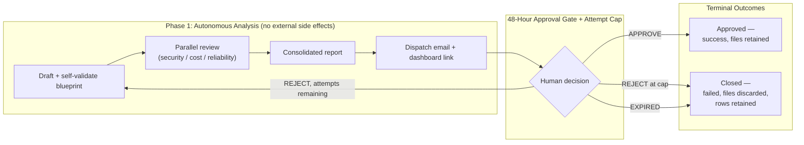
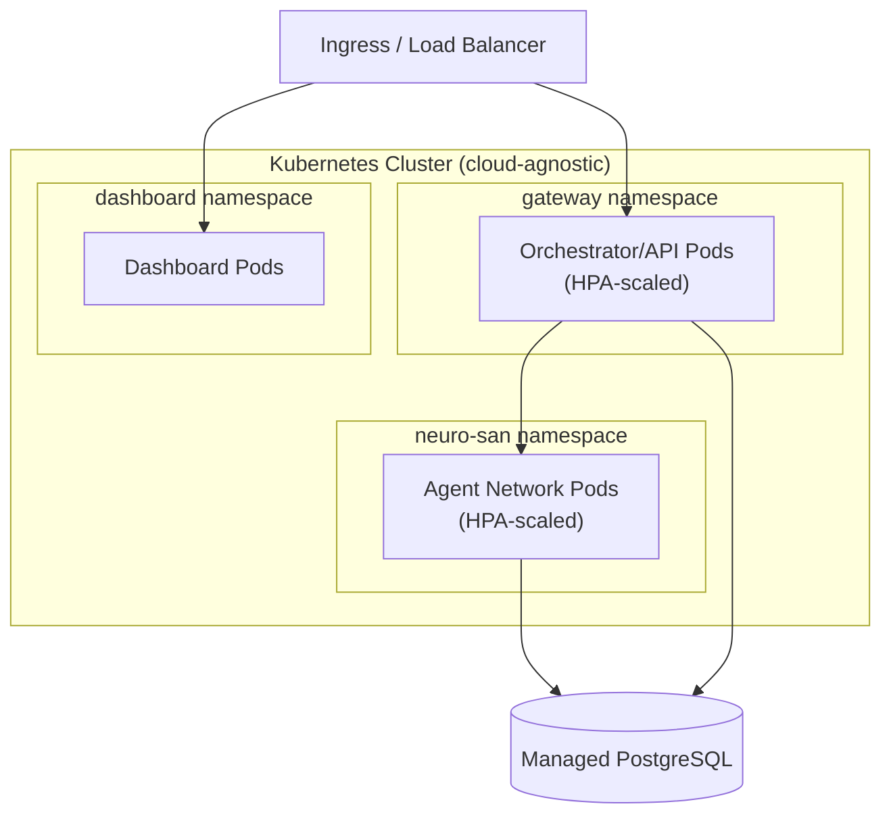
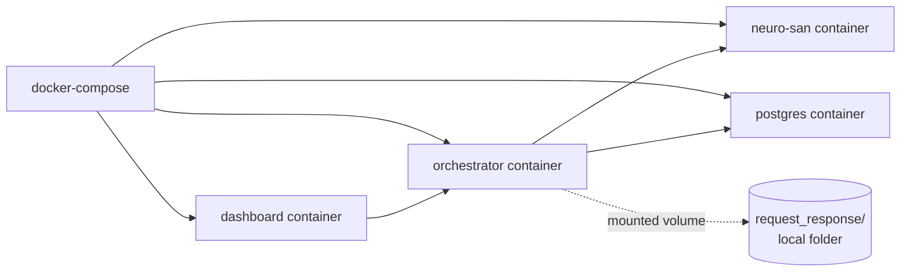

# Cartographer — Architecture Diagrams

**Derived from:** [00-problem-statement.md](00-problem-statement.md) · [02-hld.md](02-hld.md). Companions: [DFD](01-dfd.md) · [LLD](03-lld.md).

Six views: system landscape, container view, agent network topology, cross-phase signal flow, production deployment, and hackathon deployment.

> **Note:** these are *system* architecture diagrams describing how the Cartographer itself is built. They are distinct from the **migration architecture diagram** that P1 (Lead Architect Agent) generates as a product deliverable for each migration request — that per-request diagram is a rendered SVG/PNG of the target cloud resources being proposed for the stakeholder's own workload, attached to the approval-request email alongside a `Report.pdf` summary (see [00 §7 — P1](00-problem-statement.md#7-agent-by-agent-specification), [DFD D3](01-dfd.md#4-data-stores), [LLD §4.2](03-lld.md#42-blueprint)).

> **Scope reminder carried through every view below:** there is no live target-cloud-provider integration and no deployment runner in this release. Nothing in this document depicts a `terraform apply` call or a connection to AWS/Azure/GCP as a running system — the target cloud provider is only ever a string P1 uses to select which Terraform provider block to draft.

---

## V1 — System Landscape

## V2 — Container View (Deployable Units)

## V3 — Agent Network Topology (Inside Neuro-SAN)

> P1's self-validation loop (draft → `terraform_validate_tool` → retry or proceed) happens before this fan-out — see [DFD §3.1](01-dfd.md#31-p1--lead-architect-agent) for the detailed steps. There is no P8 in this topology.

## V4 — Cross-Phase Signal Flow (The Differentiator)

This is what separates this system from a simple pipeline: **Phase 1 (fully automated analysis)** and **Phase 2 (the human approval gate)** are strictly separated by one signal — the approval decision — and that decision now branches three ways instead of two.

> The prior version of this diagram routed both "expired" and "rejected" to the *same* redraft arrow back into Phase 1, and Phase 2 was labeled "Live Execution" with a `terraform apply` step. Both are corrected here: only a reject *under* the attempt cap redrafts; expiry and a reject *at* the cap both close the request with no further automation, and there is no execution phase in this release.

## V5 — Production Deployment (Conceptual)

> **Open item, not resolved in this diagram:** generated files (`report.pdf`, diagram, `.tf`) need an actual object/file store here — local-disk storage (fine for the hackathon topology in V6) does not survive these pods being horizontally scaled or restarted. Flagged in [HLD §6.2](02-hld.md#62-production-topology-target); intentionally left as an open item rather than designed further here.

## V6 — Hackathon Deployment (docker-compose)

