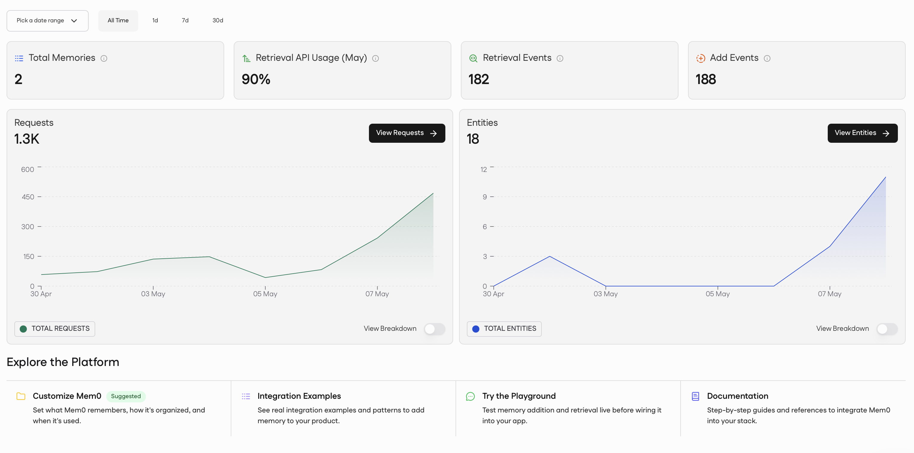
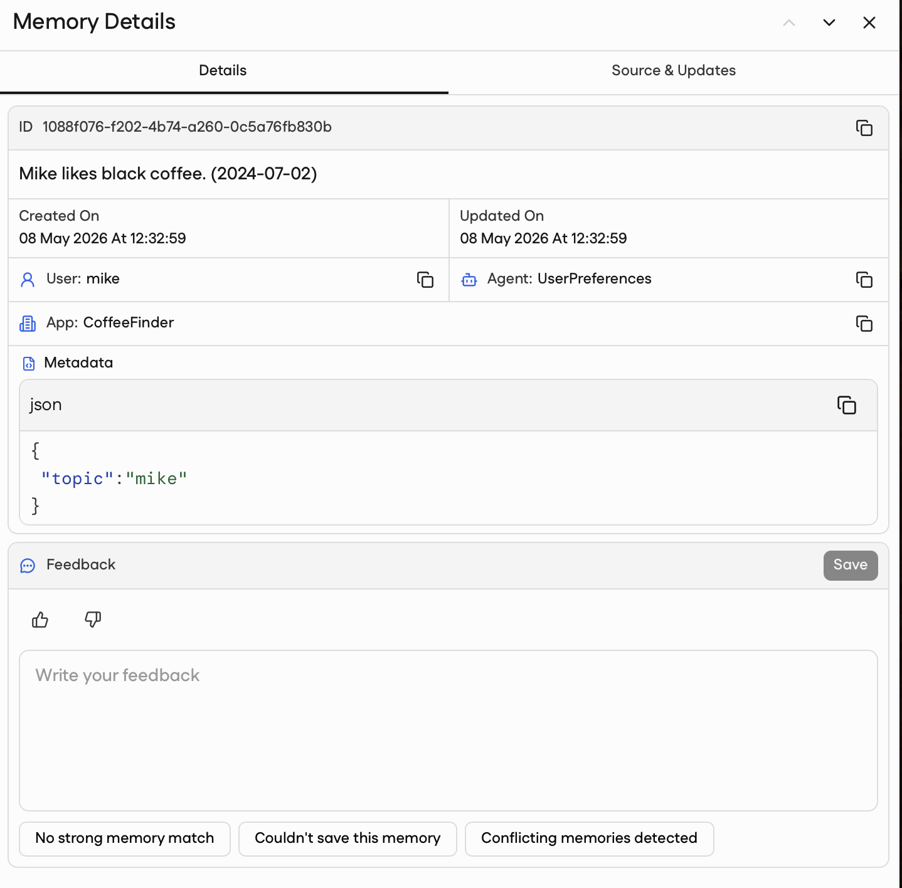

# Persistent Memory (Mem0) — cloud-backed memory

`PersistentMemoryMiddleware` with the `mem0` backend gives a Neuro-san-studio
agent long-term memory that lives in the [Mem0](https://mem0.ai) cloud
instead of on local disk. Every read and write goes through the Mem0 HTTP
API: each topic is one Mem0 memory entry, scoped by `app_id` (the agent
network) and `agent_id` (the agent name) as Mem0 fields, with
the topic name carried in `metadata.topic`. The same `(network, agent)`
namespace stays isolated from other agents in the same Mem0 account.

The middleware wiring, the LLM-facing tool, the system-prompt preamble,
and the available six operations are identical to the file-backed variant — see
[Persistent Memory (Local)](persistent_memory_local.md) for the shared parts. This page focuses
on what is specific to Mem0: per-user scoping, the API-key requirement,
and how `user_id` is resolved at call time.

## Why Mem0 instead of file-backed?

The file-backed backends (`json_file`, `markdown_file`) were designed for
**local, single-user** usage. All users sharing the same agent share the
same memory namespace, which is a footgun in multi-user deployments.

Mem0 changes that: memories are partitioned by `user_id`. Two users
talking to the same agent see two different sets of memories, even though
they hit the same `(network, agent)` namespace.

Pick Mem0 when you need any of:

- **Per-user memory** — different users must not see each other's facts.
- **Multi-host deployment** — agents running on different machines must
  share the same memory.
- **Managed durability** — you do not want to back up a `memory/`
  directory yourself.

If you only need single-user local memory, the file-backed backends are
simpler, faster, and have no external dependency. Stay on
[Persistent Memory (Local)](persistent_memory_local.md) in that case.

## Prerequisites

1. **Install the Mem0 client.**

   ```bash
   pip install "mem0ai>=2.0.2,<3.0"
   ```

2. **Get a Mem0 API key.** Sign up at <https://app.mem0.ai/> and create a
   key from the dashboard. The store reads the key from the
   `MEM0_API_KEY` environment variable on first use and raises
   `mem0.exceptions.ConfigurationError` if it is missing; subsequent
   calls reuse the cached client and HTTP session.

   ```bash
   export MEM0_API_KEY="m0-..."
   ```

3. **Decide how `user_id` is supplied.** See
   [User scoping](#user-scoping) below — for local development the env-var
   fallback is usually enough; for multi-user deployments the per-request
   `sly_data` injection is required.

## Configuration

> **Important:** attach `PersistentMemoryMiddleware` to the `middleware`
> block of **your own agent** — do not import the `persistent_memory_mem0` agent
> network as a sub-network. The middleware is what registers the tool and
> injects the preamble; calling the reference network from another agent
> will not give that agent memory.

Full configuration with every key shown at its default. `sly_data` is the only Mem0-specific essentials; the
rest mirrors the file-backed variant.

```hocon
"middleware": [
    {
        "class": "middleware.persistent_memory.persistent_memory_middleware.PersistentMemoryMiddleware",  # (required)
        "args": {
            "origin_str": true,                          # framework-injected dotted call path; used to derive the (network, agent) namespace
            "sly_data":   true,                          # framework-injected per-request data; required so Mem0 can read sly_data["user_id"]
            "memory_config": {
                "storage": {
                    "backend": "mem0"                    # cloud backend; folder_name and file_name are not applicable
                },
                "summarization": {                      # optional block — omit to leave summarization off (the default)
                    "max_topic_size":  1000,             # 0 disables summarization
                    "model":           "gpt-5.4-mini",
                    "personalization": ""                # appended to the summarizer prompt
                },
                "enabled_operations": ["create", "read", "append", "delete", "search", "list"]
            }
        }
    }
]
```

A complete reference agent using this middleware lives at
[`registries/tools/persistent_memory_mem0.hocon`](../../../registries/tools/persistent_memory_mem0.hocon).

> **Important:** Setting `"sly_data": true` is what gives each user their
> own memory. If you omit it, every user shares the same `"default_user"`
> scope — fine for local testing, broken for multi-user deployments.
>
> Setting `"origin_str": true` lets the middleware label each agent's memory
> automatically with its network and agent name (for example,
> `MemoryAssistant` in `persistent_memory_mem0`), so each agent gets its own
> slice. If you forget it, the labels fall back to `unknown.unknown` and a
> warning appears in the logs.

## Operations

Same six operations as the file-backed variant — see the
[Operations table in Local docs](persistent_memory_local.md#operations).

## Summarization

Summarization is **off by default** — minimal wiring will not summarize
anything; you must add a `summarization` block to `memory_config` to
turn it on. Otherwise it works identically to the file-backed backends
— see [Summarization in Local docs](persistent_memory_local.md#summarization).

## Quick try

The conversation flow is the same as
[Local Quick try](persistent_memory_local.md#quick-try).
Make sure `MEM0_API_KEY` is set and point your client at the
`persistent_memory_mem0` agent network.

Each write resolves to a single `client.add(...)` against Mem0. The
agent network and agent name are passed as Mem0's first-class `app_id`
and `agent_id` kwargs; only the topic name lives in `metadata`:

```python
client.add(
    messages=content,
    user_id="<resolved per call>",
    app_id="persistent_memory_mem0",
    agent_id="MemoryAssistant",
    metadata={"topic": "mike"},
    infer=False,
)
```

Restart the server and open a fresh session — as long as the same
`user_id` resolves, the agent reconstructs the facts from Mem0.
Confirm writes on the [Mem0 dashboard](https://app.mem0.ai/):



Click into an entry to see the full content, user, agent, app, and
metadata fields:



## User scoping

The single biggest difference between this backend and the file-backed
ones is that memories are partitioned by `user_id`. The store resolves
the active `user_id` on every call, in this order:

1. **`sly_data["user_id"]`** — the per-request value the framework
   injects when the middleware was constructed with `"sly_data": true`.
   This is the path used in production: each user's request carries
   their own `sly_data`, so each user gets their own Mem0 scope.
2. **`MEM0_DEFAULT_USER_ID` env var** — a plain string user ID, useful as a
   server-wide default for local testing or single-tenant deployments
   (e.g. `export MEM0_DEFAULT_USER_ID="alice"`).
3. **`"default_user"`** — fallback when neither of the above is set.
   Everything lands under a single shared scope; only useful for the
   first few minutes of poking at the system.

The resolution happens inside `Mem0Store._user_id()`, which is called on
every read/write. There is no caching — if `sly_data["user_id"]` changes
between calls, the next call lands in the new scope.

## Architecture

```text
┌───────────────────────────────────────────────────────────────┐
│ HOCON                                                         │
│   "middleware": [ PersistentMemoryMiddleware ]                │
│   args.sly_data = true                                        │
└───────────────────────────────────────────────────────────────┘
               │
               ▼
┌───────────────────────────────────────────────────────────────┐
│ PersistentMemoryMiddleware                                    │
│   - Parses HOCON → TopicStore + TopicSummarizer               │
│   - Forwards sly_data to the store factory                    │
│   - Registers the `persistent_memory` tool on the agent       │
│   - Injects a preamble into the system prompt                 │
└───────────────────────────────────────────────────────────────┘
               │ (at tool-call time)
               ▼
┌───────────────────────────────────────────────────────────────┐
│ PersistentMemoryTool                                          │
│   - Validates args, dispatches to _handle_<op>                │
│   - Talks to the store under the store's lock                 │
│   - Runs the summarizer inline on oversized content           │
└───────────────────────────────────────────────────────────────┘
               │
               ▼
┌───────────────────────────────────────────────────────────────┐
│ Mem0Store                                                     │
│   - Resolves user_id (sly_data → env var → default_user)      │
│   - Builds an AsyncMemoryClient from MEM0_API_KEY             │
│   - search with server-side compound identity filters         │
│     {user_id, app_id, agent_id}; threshold=0 disables the     │
│     semantic gate so search acts as "list all" (top_k=1000)   │
│   - add / update / delete one entry per topic (infer=False)   │
└───────────────────────────────────────────────────────────────┘
               │ HTTPS
               ▼
┌───────────────────────────────────────────────────────────────┐
│ Mem0 cloud                                                    │
└───────────────────────────────────────────────────────────────┘
```

## Debugging

- **`ConfigurationError: MEM0_API_KEY environment variable is not set.`** —
  the store could not authenticate. Export the key in the same shell
  that started the server. (Other Mem0 client errors surface as
  `mem0.exceptions.MemoryError` subclasses — `AuthenticationError` for a
  bad key, `RateLimitError`, `NetworkError`, `MemoryNotFoundError`,
  etc. — each carrying an `error_code` and `suggestion` you can log.)
- **Memories disappear between sessions** — the most common cause is
  `user_id` drift. Confirm that `sly_data["user_id"]` is the same on
  both calls (or that `MEM0_DEFAULT_USER_ID` is set the same way). When the
  ID resolves to `"default_user"` you'll see a warning in the logs.
- **Memories from a different agent show up** — verify that
  `"origin_str": true` is set; without it the namespace collapses to
  `unknown.unknown` and every agent shares one bucket.
- **Inspect remotely.** The [Mem0 dashboard](https://app.mem0.ai/)
  shows every memory under the active user, with the metadata visible
  inline. Useful for confirming that a write actually landed and that
  the `network` / `agent` tags are what you expect.
- **Latency** — every operation is an HTTPS round-trip to Mem0. For
  agents that hit memory dozens of times per turn, expect
  noticeably-higher latency than the file-backed backends. Restrict
  `enabled_operations` to keep the LLM from over-calling the tool.
- **Summaries never appear** — see the
  [summarizer notes in the Local docs](persistent_memory_local.md#summarization);
  failures are logged at `WARNING` and the original content is
  preserved.

## Source

- `middleware/persistent_memory/persistent_memory_middleware.py` — the middleware itself.
- `middleware/persistent_memory/persistent_memory_tool.py` — the
  `persistent_memory` tool the LLM calls.
- `middleware/persistent_memory/topic_store.py` — abstract store base.
- `middleware/persistent_memory/mem0_store.py` — the Mem0 cloud backend.
- `middleware/persistent_memory/topic_store_factory.py` — picks the
  backend from the `storage.backend` HOCON key and forwards `sly_data`.
- `middleware/persistent_memory/topic_summarizer.py` — the `ChatOpenAI`
  wrapper.
- `registries/tools/persistent_memory_mem0.hocon` — the reference network.
